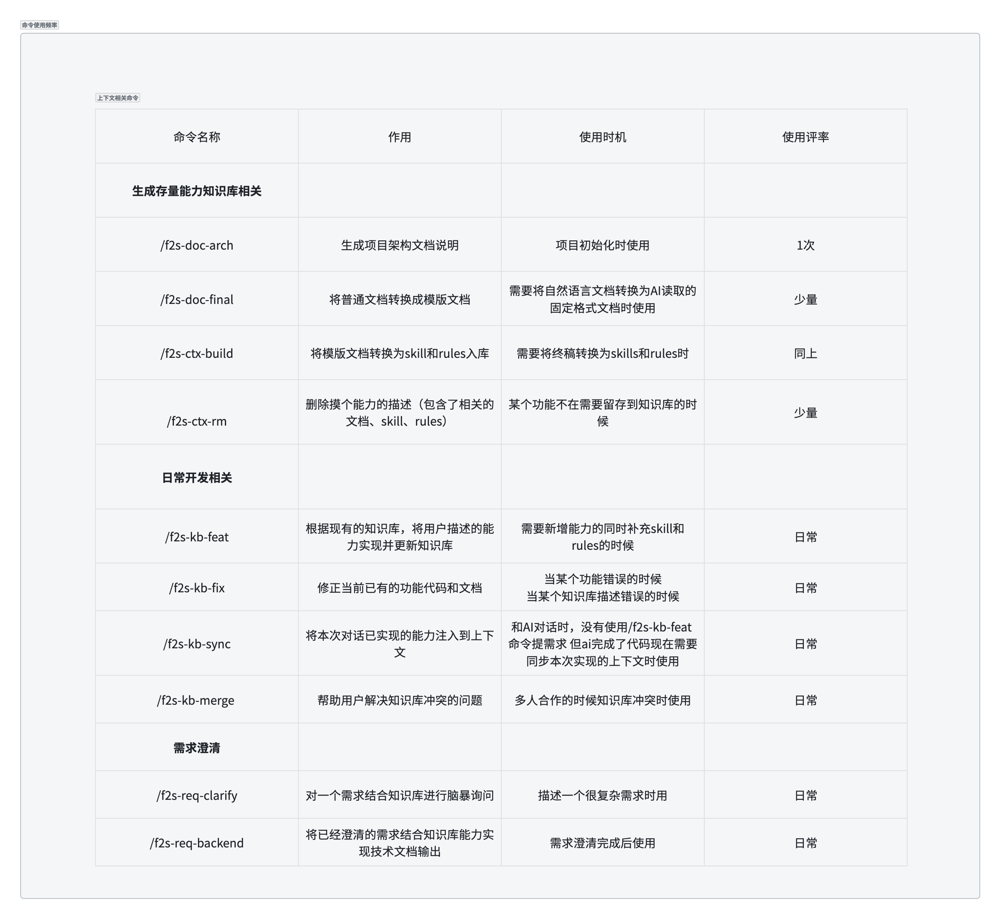
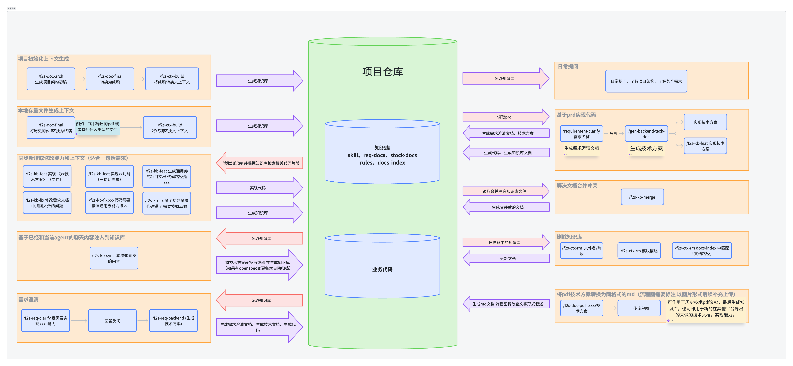
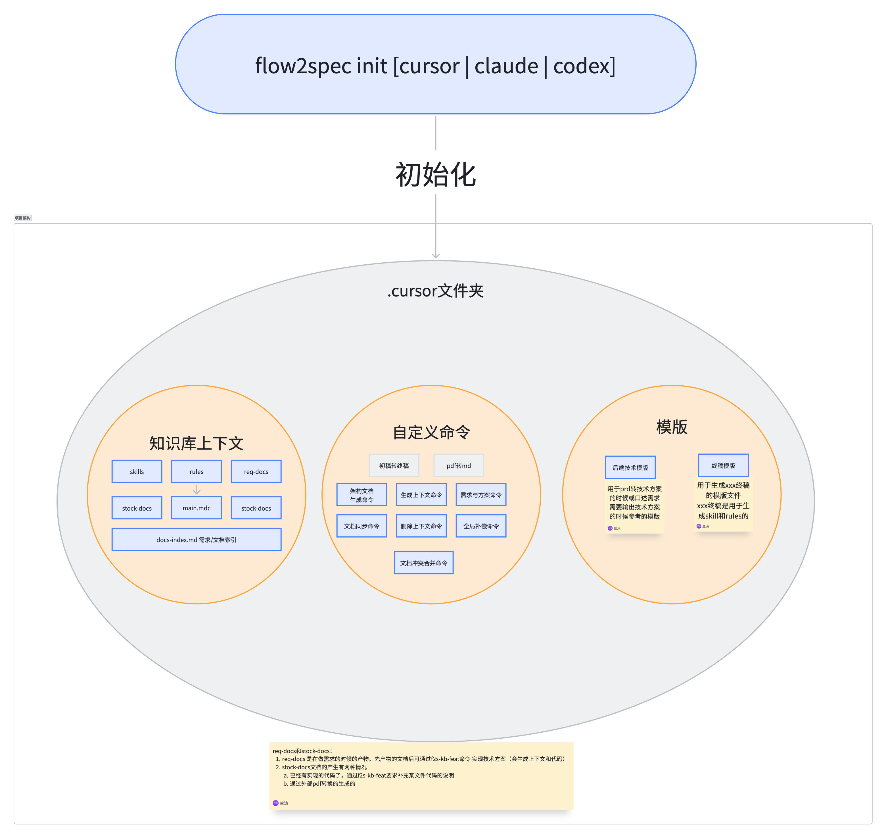
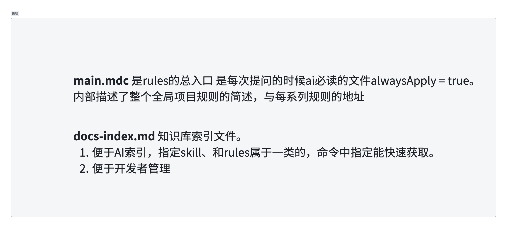

# Flow2Spec

Flow2Spec 把**配置根里的知识库**（`rules/`、`skills/`、`docs-index.md`、`stock-docs/` 等）与**业务代码**串成一条**可日复一日的闭环**：先落盘可加载的约定与索引 → 日常提问与实现都**优先就着知识库走** → 随时可用 **f2s-kb-feat** / **f2s-kb-fix** 扩展或纠错并**写回**规则与技能；**实现后**（或阶段收尾）再用 **f2s-kb-sync** 将会话/现状沉淀进知识库，下一轮对话立刻继承，少在聊天与零散文档里重复对齐口径。

**闭环为什么省事**：能力拆成一组 **f2s-*** 技能（`skills/<标识>/SKILL.md`），按「当前在闭环的哪一环」选用即可；init 一次把目录与模版备好，后续主要是**对话里触发技能 + 确认大纲/路径**，不必自己拼一套文档治理流程。

**渐进式读取带来的开发体验**：**`main.mdc`**（唯一 **alwaysApply**）先给总览与入口；**`docs-index.md`** 虽不进自动上下文，但 **`main` 生成时会写入「先打开 docs-index 再按表找 Rule/Skill」的必读约定`**，从而先索引、再专题规则/技能、再 **`stock-docs/`** 长文、**必要时才下钻业务代码**；上下文**层层加深**而非整仓硬塞，**更省 token、更少噪声**，回答更贴已写进知识库的约定与模块边界。

在**配置根的父目录**执行 **`flow2spec init`** 写入所选 AI 工具目录（默认 **`.cursor/`**，亦可 **`.claude/`**、**`.codex/`** 等）。命令与顺序见 [README-命令说明](./docs/README-命令说明.md#按使用顺序查找)，目录分工见 [目录与路径约定](./docs/README-目录与路径约定.md)，对话示例见 [Flow2Spec-使用案例-模拟对话](./docs/Flow2Spec-使用案例-模拟对话.md)。

---

## 快速开始

```bash
# 在目标代码仓库（配置根的父目录）执行（默认仅写入 .cursor/）
npx @ctrip/flow2spec init
# 指定 AI 工具配置目录（可多选）
npx @ctrip/flow2spec init claude
npx @ctrip/flow2spec init cursor claude codex
# 或全局安装后
npm install -g @ctrip/flow2spec
flow2spec init
```

- 模板按所选 **agent** 写入对应**配置根**（如 **`.cursor/`**、**`.claude/`**、**`.codex/`**）下的 `rules/`、`skills/`、`template/` 与预建 **`stock-docs/`**（存量上下文源）、**`req-docs/`**（需求与技术方案，按代码实现）。目录分工见 [目录与路径约定](./docs/README-目录与路径约定.md)。
- 工作流说明在 **`skills/<标识>/SKILL.md`**；在 Cursor 中由 Agent 按场景加载对应 Skill。
- 可用 **`flow2spec --help`** 查看全部 agent 名称与示例。

**init 详解**：[Flow2Spec使用说明 - init 做了什么](./docs/Flow2Spec使用说明.md#一init-做了什么)。

---

## 能力与入口（速览）

| 环节 | 典型技能 / 用法 |
|------|----------------|
| **沉淀知识库（架构说明）** | **f2s-doc-arch** → **f2s-doc-final** → **f2s-ctx-build**：架构初稿→终稿→Rules、Skills、索引（终稿在 `stock-docs/`） |
| **沉淀知识库（已落地能力→上下文）** | **f2s-doc-add**：**工作中**某能力**已做好**，用**一批相关文件路径**把它解析进知识库（初稿→终稿→Rules/Skills/索引）；**与**「架构说明」**那条技能链不同** |
| **按方案写代码** | **`req-docs/`** 下技术方案 MD + **`implement-tech-design`**；仅有 PDF 时可用 **f2s-doc-pdf** |
| **纠错与扩展** | **f2s-kb-feat**、**f2s-kb-fix**（任意时机） |
| **实现后写库** | **f2s-kb-sync**（会话/现状 → 大纲确认后写库） |

更细的入参、输出与顺序：[README-命令说明](./docs/README-命令说明.md) · 使用手册：[Flow2Spec使用说明](./docs/Flow2Spec使用说明.md) · 使用案例：[Flow2Spec-使用案例-模拟对话](./docs/Flow2Spec-使用案例-模拟对话.md)。

---

## 原理与流程图解

下图与「闭环日常流」「渐进式读取」一一对应；技能标识以 **f2s-*** 为准，与图不一致处以 [README-命令说明](./docs/README-命令说明.md) 为准。

### 命令明细（名称、作用、使用时机与频率）



### 日常操作与项目仓库（知识库与业务代码）



### init 与配置根结构（以 `.cursor` 为例）



### main.mdc 与 docs-index.md



### 简述：知识库与代码闭环


---

## 文档导航

| 文档 | 说明 |
|------|------|
| [**Flow2Spec使用说明**](./docs/Flow2Spec使用说明.md) | **使用手册**：init、目录约定、推荐顺序、典型流程、技能与工作流、常见问题 |
| [**Flow2Spec-使用案例-模拟对话**](./docs/Flow2Spec-使用案例-模拟对话.md) | **对话版式与场景**：真实输入、命令解释、渐进读取与 **f2s-*** 示例 |
| [README-命令说明](./docs/README-命令说明.md) | 各命令入参/输出、**按使用顺序查找**、快速参考 |
| [README-目录与路径约定](./docs/README-目录与路径约定.md) | **配置根**下 `stock-docs/`、`req-docs/` 等结构、路径与链接约定、文档产物阶段 |
| [README-体系与原理](./docs/README-体系与原理.md) | 架构、设计原则、main 与 docs-index 区别 |

---

## CLI

| 命令 | 说明 |
|------|------|
| `flow2spec init [agent ...]` | 将模板写入所选配置根（默认 `cursor` → `.cursor/`）；详见 **`flow2spec --help`** |
| `flow2spec --help` | 查看用法、可选 agent（cursor / claude / codex）与示例 |

技能列表与速查见 [Flow2Spec使用说明](./docs/Flow2Spec使用说明.md)。
