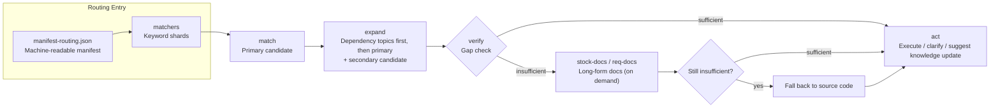
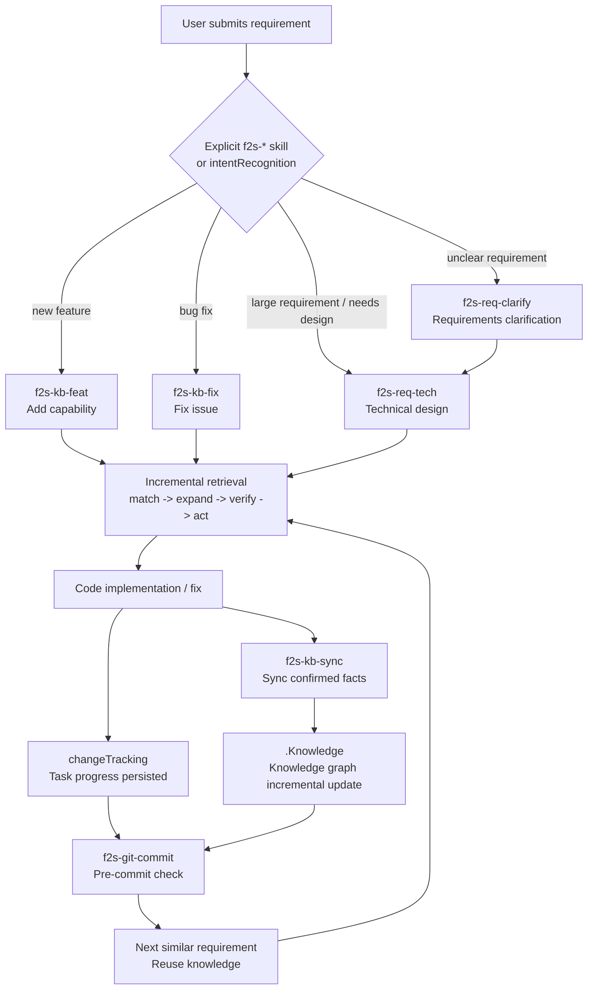
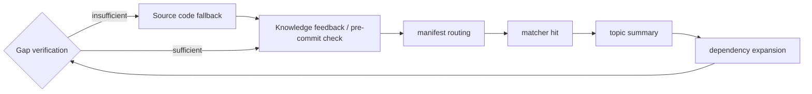

# AI Coding Doesn't Lack Context — It Lacks a Project Knowledge Graph That Grows With Development

## I. Introduction

Over the past year, many AI coding tools have been solving the same problem:

**Helping Agents remember project context.**

That matters, of course.  
But talking about "project memory," "context management," and "rule files" alone is no longer enough.

Many open-source projects are already doing similar things:

- Writing an `AGENTS.md` / `CLAUDE.md`
- Adding a set of rules
- Creating a docs directory
- Having the Agent read project documentation first
- Or connecting a vector store for retrieval

These approaches help, but what I really want to solve isn't "stuffing a bunch of context into the AI at startup."

What I want to solve is:

**Can project knowledge be continuously accumulated, automatically routed, continuously validated, and evolve alongside the code — throughout the actual development process?**

That's Flow2Spec.

One-line summary:

**Flow2Spec is an Agent engineering framework that lets a project naturally grow a knowledge graph during development.**

It's not a static document library.  
Its core isn't "putting materials in" — it's closing the loop between requirements, technical designs, code changes, knowledge updates, and task progress on a single development chain.

---

## II. Why "Memory" Alone Isn't Enough

After many projects integrate AI, they quickly run into a paradox:

You want the AI to understand the project better.  
But the more context you give it, the more likely it is to miss things, go off track, or forget what matters.

So people keep adding rules:

- Read this file first
- Then read that directory
- Don't touch this module
- That interface has legacy compatibility
- Remember to update the docs after changes

Eventually the context becomes another burden.

It looks like a knowledge base, but it's really more like an ever-expanding instruction manual.  
Every time, the Agent has to dig through the manual to find answers — and even when it does, it often doesn't know what to feed back.

Flow2Spec's position is:

**Project knowledge can't just be "written down." It needs to be routable, composable, verifiable, and continuously updated.**

---

## III. Flow2Spec's Key Difference: A Knowledge Graph That Grows During Development

Flow2Spec doesn't ask you to do a massive documentation effort upfront.

The recommended approach is:

1. Run `flow2spec init` to initialize an empty skeleton.
2. Use `f2s-doc-arch` to generate an architecture overview, then gradually bring the project's overall structure into the knowledge base.
3. When real requirements arrive, have the Agent route through existing knowledge first — no rush to search the entire codebase.
4. If you know the current iteration's module isn't in the knowledge base yet, use `f2s-kb-add <module-path>` to parse and add it first.
5. If knowledge gaps surface during development, the Agent prompts you to fill them from code or requirements documents.
6. After implementation, use `f2s-kb-sync` to sync confirmed facts back into the knowledge base. If you forget, a pre-commit check or a Q&A closing step will surface the gap again.
7. The next time a similar requirement comes up, draw from this knowledge incrementally.

In other words, knowledge isn't built all at once.

**It grows naturally through the process of requirements clarification, technical design, code implementation, bug fixing, knowledge sync, and committing code.**

This is what sets Flow2Spec apart from ordinary "project memory files."

An ordinary solution is like handing the Agent a manual.  
Flow2Spec is more like maintaining an evolvable knowledge graph for the project:

- What the topics are
- Which rules each topic depends on
- What the trigger keywords are
- Which summary to read
- When to drill into long-form documents
- Which knowledge is already covered
- Which knowledge needs to be added

This information isn't scattered across chat logs — it lives in the repository's `.Knowledge/` directory, where it can be diffed, reviewed, and committed alongside code.

---

## IV. The Knowledge Base Interface: Not a Pile of Docs, but a Routing Protocol

Flow2Spec's knowledge base isn't "a bunch of Markdown files stacked together."

It has a clear interface structure:

```text
.Knowledge/
  manifest-routing.json   # Machine-readable routing manifest
  matchers/               # Keyword shards
  topics/                 # Topic summaries
  stock-docs/             # Long-form docs for shipped capabilities
  req-docs/               # Requirements and technical design docs
```

The Agent's reading order isn't free-form — it follows the protocol:

```text
manifest-routing.json
  -> matcher shard (single file pointed to by matcherPath)
  -> match (primary candidate)
  -> expand (dependency topics first, then primary topic; keep secondary candidate)
  -> verify (gap check)
      -> sufficient: act
      -> insufficient: stock-docs / req-docs (on demand)
          -> still insufficient: fall back to source code
          -> act or clarify
```

Figure 1: Incremental Knowledge Retrieval



The value of this structure:

**The knowledge base doesn't expose "files" to the Agent — it exposes an interface for "how to find the right knowledge."**

`manifest-routing.json` tells the Agent what topics exist.  
`matchers/*.json` tells the Agent which topics a given task might match.  
`topics/*.md` gives the Agent short summaries and hard constraints.  
`topicDependencies` tells the Agent which prerequisite rules must be read together.  
`stock-docs/` and `req-docs/` are only drilled into when needed.

Flow2Spec also supports annotating topics with a type tag:

- `feature`: A shipped business or product capability
- `module`: A shared module, directory structure, or engineering boundary
- `config`: Configuration items, switches, defaults
- `policy`: Processes, rules, constraints, gates

This `topicMetadata` doesn't directly participate in matcher matching and doesn't replace constraints in the topic body.  
It's more like a layer of reading intent and governance metadata — it helps the Agent know whether to focus on business capabilities, module boundaries, configuration, or process rules for a given topic. It also enables knowledge base audits and topic bloat checks.

This means the Agent doesn't need to search the entire codebase every time, and doesn't need to read all rules at once.

---

## V. Incremental Retrieval: The Agent Only Takes What It Needs

Flow2Spec's retrieval model can be summarized in four steps:

```text
match -> expand -> verify -> act
```

### match: Hit a topic first

The Agent reads `manifest-routing.json`, then reads the corresponding matcher shard for the task.  
It doesn't traverse the entire knowledge base — it narrows down candidates first.

### expand: Then expand dependencies

Real business tasks rarely involve a single point of knowledge.

A feature might simultaneously depend on:

- Common configuration rules
- Auth rules
- A specific business module
- A commit constraint
- A technical design process

Flow2Spec makes these relationships explicit through `topicDependencies`.  
After hitting the primary topic, the Agent continues reading dependency topics, avoiding partial rule coverage.

### verify: Check for gaps before acting

Hitting a topic doesn't guarantee the knowledge is sufficient.

Flow2Spec requires the Agent to check before acting:

- Does the current topic actually cover the user's question?
- Are there missing critical dependencies?
- Is a long-form document needed?
- Is source code needed?
- Should the user be asked for clarification first?

This step matters.  
It turns "looks like a match" into "confirmed ready to act."

### act: Only act when confidence is sufficient

Only when knowledge coverage is sufficient and boundaries are clear does the Agent proceed to implement, modify, or commit.  
If confidence is low, it clarifies first — it doesn't just forge ahead.

---

## VI. Multi-Dependency Capability: Don't Let the Agent Read Only Half the Rules

In real projects, many errors don't happen because the AI read nothing.  
They happen because it read only a local piece of knowledge and missed a prerequisite constraint.

For example:

- Changing a feature while reading the business topic, but missing the commit rules.
- Generating a technical design while reading requirements, but missing the req-docs / stock-docs boundary rules.
- Modifying config while reading the module description, but missing the config switch defaults.
- Planning tasks while reading implementation steps, but missing the `.task/` tracking rules.

Flow2Spec makes these dependencies explicit in the routing layer.

A topic can declare which other topics it depends on.  
When the Agent hits a primary topic, it first expands the dependencies, then reads the primary topic.

This isn't just "read a few more files."  
Its significance is transforming project knowledge from flat documents into a graph with edges:

```text
Feature implementation
  -> Document routing rules
  -> Technical design rules
  -> Task tracking rules
  -> Git commit rules
```

This graph structure is one of Flow2Spec's core ideas.  
It means every time the Agent reads, it gets not an isolated fragment, but a declared combination of context.

---

## VII. Knowledge Base Correctness: Writing a Topic Isn't Enough

Two things kill a knowledge base:

1. Going stale.
2. Being wrong.

Flow2Spec doesn't assume the knowledge base is always correct.  
It builds "verification" into the development process.

A typical scenario is a regular Q&A:

The user asks a business detail.  
The Agent checks the knowledge base, finds topic coverage, but the answer isn't detailed enough.  
It drills into the source code and gets a more accurate fact.

At this point, Flow2Spec shouldn't just answer and move on.  
It also needs to determine:

- Has this fact already been written into the topic?
- If not, should it suggest `f2s-kb-sync`?
- If the entire module isn't in the knowledge base, should it suggest `f2s-kb-add <path>`?
- If the knowledge appears covered, can it prove the coverage source? If not, it can't stay silent.

This is the "knowledge base feedback closing step."

It solves a very practical problem:

**The AI found new knowledge in the source code, but that knowledge can't just live in this one chat session.**

Otherwise next time it'll search the source code all over again.

Flow2Spec wants every source code dive to become a knowledge base quality check.  
After answering, if a knowledge gap is found, give a clear follow-up command; if it's already covered, don't bother the user.

---

## VIII. User Intent Recognition: Not Every Message Should Trigger a Workflow

Another easily overlooked issue: when the user says something, should the Agent answer, discuss, clarify, or jump straight into a development workflow?

For example:

```text
Is this approach feasible?
```

This should be a discussion — not a signal to start writing code.

Or:

```text
Fix this bug
```

This probably should enter the fix workflow.

Or:

```text
I want to add a new feature — help me clarify the requirements first
```

This should enter requirements clarification, not immediately generate a technical design or start implementing.

Flow2Spec has an `intentRecognition` switch.  
When enabled, the Agent uses intent recognition rules to assist with judgment:

- High-confidence new feature → enter feat workflow
- High-confidence bug fix → enter fix workflow
- Unclear requirements → enter req-clarify
- Just asking / discussing / evaluating → stay in normal conversation
- Current workflow not finished → don't accidentally switch to a new one

This matters.

Many automation failures aren't because the tool can't execute — they're because it's too eager.  
Flow2Spec's goal isn't "run a skill for any message" — it's to have the Agent enter the right workflow at the right time.

That said, this area is still being validated.  
For now, explicit `f2s-*` skills are recommended — just type `f2s-req-clarify`, `f2s-kb-feat`, `f2s-kb-fix` directly.  
Explicit commands are more stable than automatic intent recognition, and they make it easier for users to know which workflow they're in.

---

## IX. A More Realistic Development Loop

With Flow2Spec, a requirement might flow like this:

```text
User submits requirement
  -> Explicit f2s-* skill / intentRecognition assists
  -> f2s-req-clarify until no ambiguity
  -> f2s-req-tech generates technical design
  -> Agent reads knowledge base incrementally
  -> Implements code
  -> changeTracking records task progress
  -> f2s-kb-sync syncs new knowledge
  -> f2s-git-commit pre-commit check
```

Figure 2: Knowledge Graph Growing Through Development



Every step in this chain leaves a trackable asset:

- Requirements documents in `req-docs/`
- Shipped knowledge in `stock-docs/`
- Topic summaries in `topics/`
- Routing relationships in `manifest-routing.json`
- Task progress in `.task/`
- Execution rules in each Agent's configuration

So Flow2Spec isn't about "making the AI answer better in a single session."  
It's about turning each development process into an incremental update to the project's knowledge graph.

---

## X. It Manages More Than Knowledge — It Manages the Development Loop

The knowledge graph is only part of Flow2Spec.  
If you only accumulate knowledge but leave tasks, validation, commits, and upgrades scattered outside, Agents can still easily break down in long workflows.

So Flow2Spec adds several development-side capabilities.

### Task Progress Persistence

When `changeTracking` is enabled, the Agent writes a task checklist to `.task/` when implementing features or executing a technical design.  
When a new session picks up where the last one left off, there's no need to ask "where did we stop?" — just resume from the on-disk task.

User-side todos can also be tracked separately from Agent steps.  
Things like running SQL, configuring environment variables, or confirming a production switch shouldn't be mixed in with the Agent's own checklist.

### Technical Designs Don't Follow a Rigid Template

`f2s-req-tech` selects an appropriate structure based on the current requirement.  
It doesn't mechanically fill in every section — it decides based on requirement type whether to include flows, data models, config, message queues, frontend interactions, API contracts, and so on.

This avoids a common problem: a frontend interaction or toolchain change generating a template full of "interfaces," "databases," and "backend configuration."

### Multi-Agent Orchestration and Verification

Complex tasks can be split to sub-Agents via `subAgent`, with the primary Agent handling coordination, aggregation, and final judgment.  
When `switchAgentVerification` is enabled, the writer and verifier are separated, reducing the risk of an Agent writing, verifying, and approving its own work.

### Pre-Commit Knowledge Coverage Check

`f2s-git-commit` isn't just about generating a commit message.  
It checks the diff, conflict markers, and staging scope before committing — and in default mode, checks whether the current changes require a knowledge base sync.

This turns "changed code, forgot to update knowledge" into something that can be caught before the commit.

### Template and Routing Upgrade Detection

Flow2Spec also supports version checking for the knowledge base template at startup.  
If the current project's `.Knowledge` structure is behind the npm package version, the Agent prompts you to run `f2s-kb-upgrade`, keeping downstream projects aligned with the latest routing structure and rule templates.

Together, these capabilities make Flow2Spec more than a knowledge directory — it's a closed loop built around the Agent development process.

---

## XI. The Biggest Difference from Ordinary Knowledge Bases

If I had to summarize the difference in one sentence:

**An ordinary knowledge base is something Agents query. Flow2Spec's knowledge base is something Agents help maintain.**

Figure 3: Ordinary Memory Files vs Flow2Spec Knowledge Graph




Ordinary knowledge bases focus on:

- Where to put documents
- How to retrieve them
- How to summarize them

Flow2Spec focuses more on:

- Which topic to read when a requirement arrives
- What dependencies exist between topics
- Whether current knowledge is sufficient to act
- Whether to feed knowledge back after a source code dive
- Whether user intent should trigger a workflow
- Whether knowledge should be updated alongside code changes
- Whether knowledge coverage was checked before committing

This is also why Flow2Spec includes all of:

- `.Knowledge/`
- `.task/`
- `f2s-*` skills
- Agent rules
- `flow2spec.config.json`

They aren't separate pieces — they're a protocol organized around the development loop.

---

## XII. Common Questions

### After changing a capability, how do I make sure all related topics get updated?

Flow2Spec doesn't promise "the model will automatically know all the impact areas."  
What it does is turn impact discovery into an executable process.

A single capability change often affects more than one topic.  
For example, changing "batch rescoring" might affect:

- The business capability topic: how this feature now works
- The config topic: whether any switches, defaults, or thresholds changed
- The rules topic: whether idempotency, locking, error codes, or pre-commit checks changed
- The module topic: whether shared methods, directory boundaries, or call chains changed

Flow2Spec raises coverage through several mechanisms:

1. The routing layer finds the primary topic via matcher.
2. `topicDependencies` expands dependency topics, avoiding partial knowledge updates.
3. `f2s-kb-sync` first outputs an update outline for the user to confirm which topics need changes.
4. When a Q&A drill-down finds a topic isn't fully written, it prompts a supplement.
5. `f2s-git-commit` does a knowledge coverage check by default, so code commits don't miss knowledge syncs.

Example:

If you changed an "activity lottery count" feature, the knowledge update shouldn't just say "the lottery API changed."  
It might also need to update:

- The activity business topic: how lottery counts are calculated
- The data model topic: which fields record claimed / remaining counts
- The rules topic: restrictions on browsing tasks, purchase tasks, and duplicate claims
- The config topic: prize lists, switches, activity timing

Flow2Spec's goal isn't to have the Agent intuitively edit one file — it's to have it first list "which topics this change might affect," confirm with the user, then write to disk.

### How does Flow2Spec solve the problem of Agents forgetting rules?

This question has two sides: **downstream project usage** and **Flow2Spec's own design**.

**Downstream usage side.**

The most common problem in downstream projects is: opening a new session and having the Agent forget the project's rules; or reading only part of them.

Flow2Spec's approach isn't to stuff all rules into one giant file — it's to break rules into routable, dependency-aware knowledge:

- Project entry rules go into `AGENTS.md` / `.cursor` / `.claude` / `.codex`
- Business knowledge goes into `.Knowledge/topics/`
- Matching keywords go into `.Knowledge/matchers/`
- Topic dependencies go into `topicDependencies`
- Long-form docs go into `stock-docs/` or `req-docs/`

The Agent doesn't act from memory — it re-fetches rules via `match -> expand -> verify -> act` every time.

For example:

- When writing code, read implementation-related topics
- When generating a technical design, read technical design rules and requirements document boundaries
- When committing code, read git commit rules
- After a Q&A source code drill-down, read the knowledge base feedback closing rules

This solves the problem of "rules scattered, rules too long, rules incompletely read."

**Flow2Spec's own design side.**

Flow2Spec itself has a layered constraint system to reduce "rules exist but Agents don't follow them":

1. Entry layer: `AGENTS.md` / per-IDE rules declare reading order, prohibitions, and incremental retrieval principles.
2. Config layer: Before executing any `f2s-*` skill, `flow2spec.config.json` must be read to confirm `subAgent`, `switchAgentVerification`, `intentRecognition`, and other switches.
3. Routing layer: All Q&A and development tasks read `manifest-routing.json` first, then retrieve by matcher / topic — no direct full-codebase search.
4. Skill layer: Each `f2s-*` skill defines its own pre-checks, user confirmation points, disk-write steps, and closing steps.
5. Gate layer: Gates are set at multiple nodes, not just at commit time. Task archival checks the checklist before moving to completed (`f2s-task`); knowledge writes confirm the outline before persisting (`f2s-kb-sync`); after a Q&A source code drill-down, a mandatory closing self-check is required (`f2s-kb-feedback-closing`); and a diff and knowledge coverage check runs before code commits (`f2s-git-commit`).

Two typical scenarios show how these five layers work in practice:

One is preventing intent misfire — when the user is still in the clarification stage, the Agent must not jump to implementation.  
The other is preventing knowledge from not being fed back after a source code answer — the Agent must determine whether `f2s-kb-add` or `f2s-kb-sync` is needed; silent skipping is not allowed.

Flow2Spec's goal isn't to completely eliminate forgetting — it's to make "bypassing rules" harder at every stage.

### What if a single topic file gets too large?

Flow2Spec discourages stuffing a large feature into one giant topic.

A topic's role is "routing summary":  
It records trigger keywords, boundaries, key constraints, and next-step pointers — it doesn't carry all the details.

Long content belongs in `stock-docs/`.  
If a feature is large, break it into multiple focused topics, and connect them with `topicDependencies`.

For example, a feature with ten thousand lines of code could be broken into:

```text
topics/
  activity-overview.md
  activity-task-rules.md
  activity-data-model.md
  activity-external-dependencies.md

stock-docs/
  activity-overview_final.md
  activity-task-rules_final.md
  activity-data-model_final.md
  activity-external-dependencies_final.md
```

The Agent reads "activity-overview" first to judge relevance.  
If the user asks about the task state machine, it then reads "activity-task-rules."  
If the user asks about table fields, it reads "activity-data-model."

This avoids two problems:

- Topics too large for the Agent to read thoroughly or extract key points from
- Trigger keywords too broad, causing one topic to match all kinds of tasks

### What if the knowledge base doesn't cover the current module?

This is a scenario Flow2Spec takes seriously.

If the Agent can't find an answer through the knowledge base but finds one through source code, it shouldn't just give you the answer.  
It should also suggest:

```text
Suggested: f2s-kb-add <module-path>
```

If the module is already in the knowledge base but the topic isn't fully written, suggest:

```text
Suggested: f2s-kb-sync <topic or capability description>
```

The difference between these two commands:

- `f2s-kb-add`: The module hasn't been parsed into the system yet — use this to bring an entire module in
- `f2s-kb-sync`: The module is already in the knowledge base, but this session surfaced new facts — use this to sync incremental knowledge

The value of this mechanism:  
Every time you "find an answer in source code," it can become a knowledge base improvement.

---

## XIII. What Projects Is This For?

Flow2Spec works best for:

- Medium to large business projects.
- Long-lived codebases.
- Multi-person teams with many rules.
- Teams that frequently use Cursor / Claude Code / Codex.
- Projects where you want AI to not just "read docs" but participate in maintaining project knowledge.

If you're working on a one-off script or a very small personal project, Flow2Spec might feel heavy.  
A simple readme is probably enough.

But if your project already has these problems:

- Having to explain the same business rules to the AI every time.
- AI frequently missing prerequisite constraints.
- Docs and code getting more and more out of sync.
- New sessions not knowing where the last task left off.
- Agent finds a fact in source code, then forgets it next session.

Then Flow2Spec is built for exactly these problems.

---

## XIV. Quick Start

Initialize:

```bash
npx @double-codeing/flow2spec@latest init
```

When getting started, it's recommended to use explicit `f2s-*` skills first.  
Once you're familiar with the workflows, enable and validate `intentRecognition` auto-routing as needed.

Common workflows:

```text
/f2s-req-clarify   Requirements clarification
/f2s-req-tech      Generate technical design
/f2s-kb-feat       Add capability and sync knowledge
/f2s-kb-fix        Fix issue and correct knowledge
/f2s-kb-add <path> Parse an existing module into the knowledge base
/f2s-kb-sync       Sync newly confirmed facts
/f2s-git-commit    Pre-commit check and generate commit message
```

Currently supports initialization for Cursor, Claude Code, and Codex, with both Chinese and English templates.

---

## XV. Closing

I don't think the end goal of AI coding is "writing more code."

The truly hard part is:

**Letting AI continuously understand context in long-lived projects, and accumulating the new knowledge produced by each development cycle.**

That's what Flow2Spec is trying to do.

It turns project knowledge from static documents into a routable, dependency-aware, verifiable, feedback-capable knowledge graph.  
It makes Agents not just consumers of context, but participants in maintaining it.

If you're working on a long-lived project and want AI to stop starting from zero every time, give it a try:

```bash
npx @double-codeing/flow2spec@latest init
```

Project repository:  
`https://github.com/lands-1203/Flow2Spec`

Live demo:  
`https://lands-1203.github.io/Flow2Spec/`
