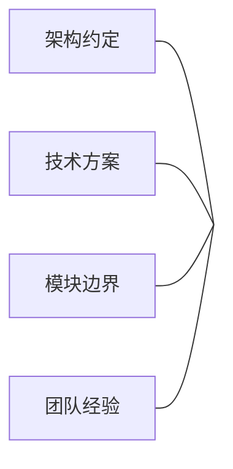
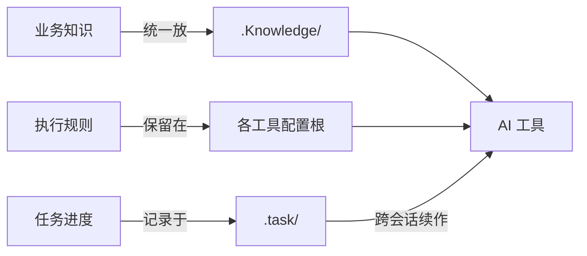
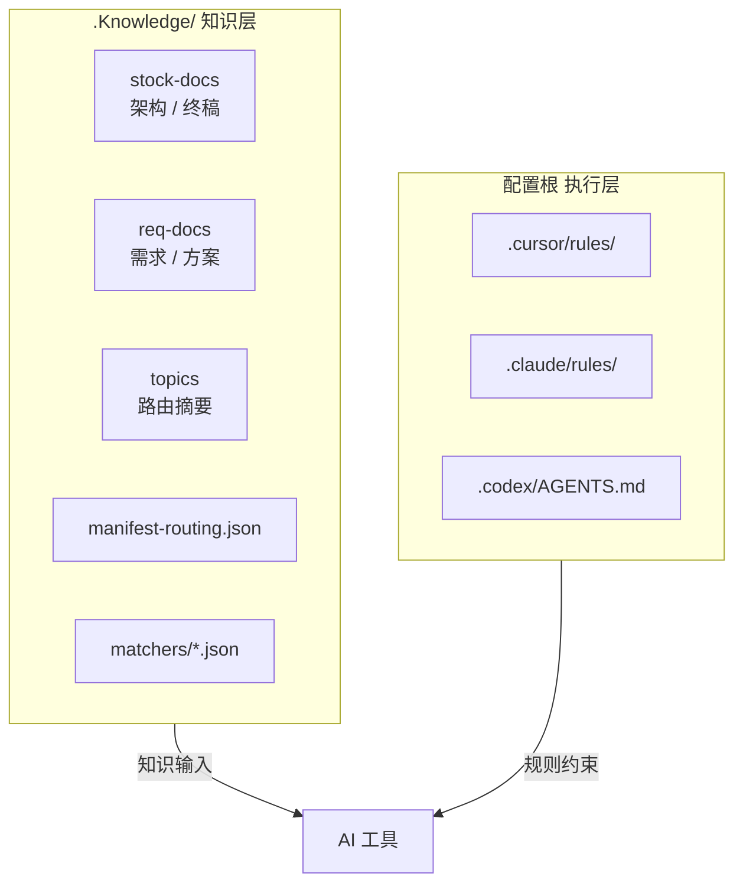
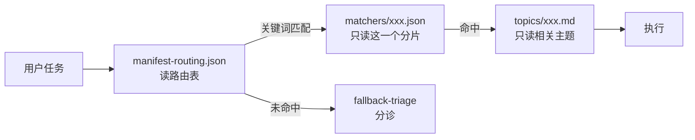
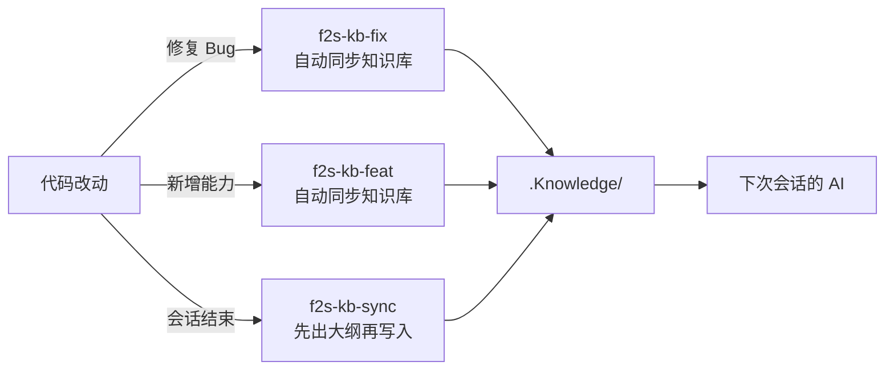
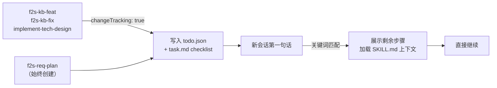
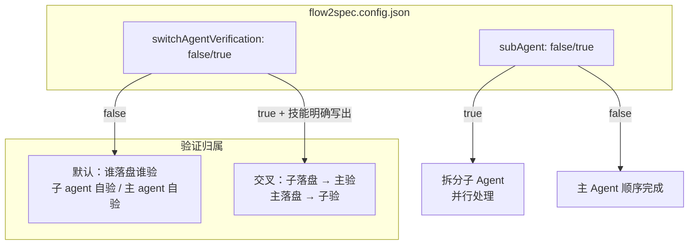

# Flow2Spec 演讲稿

> 每张幻灯片：标题 + 图 + 极少文字。演讲说明在引用块里。

---

## Slide 1 · 开场

```
Flow2Spec

让 AI 持续理解你的项目
```

---

## Slide 2 · 你遇过这种情况吗？

```
┌─────────────────────────────────────────────┐
│                                             │
│   你：  帮我改一下订单模块的支付回调逻辑     │
│                                             │
│   AI：  好的，我来看一下……                  │
│         （把整个项目翻了一遍）              │
│         这个回调是 Webhook 还是轮询？        │
│         幂等键是什么？用什么存储？           │
│         有没有失败重试机制……                │
│                                             │
│   你：  （开始从头解释项目背景）            │
│                                             │
└─────────────────────────────────────────────┘
```

> 每次新会话都要重新介绍项目，是所有用 AI 协作开发的团队的共同痛点。背景质量取决于你那天愿意解释多少。

---

## Slide 3 · 问题的根源




**知识散落在三个地方：代码、文档、人脑**

没有结构 → AI 每次从零开始

> 不是 AI 变笨了，是它每次都在盲飞。

---

## Slide 4 · Flow2Spec 是什么

```
一套规范 + 工具链

把项目知识组织好  →  让 AI 随时能读懂
```




> 不是新的 AI 框架，不是新的工具。就是一套把知识放对地方的规范。

---

## Slide 5 · 两层结构




**知识随项目迭代  ·  规则随工具升级**

> 两者生命周期不同，混在一起就会互相干扰。分开是这套设计最基本的决策。

---

## Slide 6 · 不是全量加载，是精准路由




**上下文窗口有限  ·  加载什么 = 不加载什么**

> 大多数系统是把所有文档塞进去，再让 AI 自己过滤。Flow2Spec 反过来，先路由再加载。

---

## Slide 7 · 四步流水线

```
match          expand         verify         act

命中主候选  →  展开依赖主题  →  缺口检查   →  执行
                              ↓
                         置信度不足
                              ↓
                           先澄清
```

**不是命中就跑，是确认够了再动**

> 防止 AI 拿着半份信息就开始干，干到一半发现方向不对。

---

## Slide 8 · matchers 分片是个细节，但很重要

```
❌ 常见做法                    ✅ Flow2Spec

manifest.json                  manifest-routing.json
├── task1                      ├── task1 → matcherPath: m-order.json
│   └── keywords: [...]        ├── task2 → matcherPath: m-payment.json
├── task2                      └── task3 → matcherPath: m-refund.json
│   └── keywords: [...]
└── task3                      m-order.json      ← 路由时只读这一个
    └── keywords: [...]        { includeAny: [...] }
```

- 更新关键词不需要动路由结构
- 每次路由 token 成本固定且极小

> 关键词会随业务演化频繁更新，路由结构相对稳定。把两者混在一起，每次小改都要读大文件。

---

## Slide 9 · topicDependencies：依赖挂在主题上

```
❌ 挂在任务级                  ✅ 挂在主题级

task: implement               topicDependencies:
  topics:                       implement-tech-design:
    - stock-docs-vs-req-docs      - stock-docs-vs-req-docs
    - implement-tech-design
                               任何路径加载 implement-tech-design
task2: (新增，漏写了前置)      都自动带上前置依赖
  topics:
    - implement-tech-design    ← 新增任务不需要重新声明
    ← 漏了前置，静默失效
```

> 语义上的"必须先理解 X 才能做 Y"，应该在 Y 上声明，而不是在每条任务上重复声明。

---

## Slide 10 · 知识维护闭环




**维护知识库不是额外的工作  ·  是开发动作的一部分**

> 知识库腐化的原因通常不是懒，是把"更新文档"当成了另一件要做的事。这里的设计是让它变成同一件事。

---

## Slide 11 · 完整工作流

```
新需求
  │
  ▼
f2s-req-clarify ── 澄清需求边界、反问直到清楚
  │
  ▼
f2s-req-backend ── 生成技术方案 → req-docs/
  │
  ▼
implement-tech-design
  ├── 输出任务列表        ← 不可跳过
  ├── 实现前提问          ← 不可跳过
  ├── 按任务实现
  └── 输出待完成清单
  │
  ▼
f2s-kb-feat ── 新能力同步进知识库
```

> implement-tech-design 里强制步骤是写在规则里的约束，不是文档建议，不能被跳过。

---

## Slide 12 · 任务清单与跨会话续作

```
会话中断了怎么办？
```




```
模式 A  changeTracking: true    技能自动创建清单，下次会话关键词自动续作
模式 B  f2s-req-plan            明确规划 + 实现，始终创建清单，不依赖配置
```

**任务不会因为会话结束而丢失  ·  技能约束可完整恢复**

> 大模型没有跨会话记忆，这是结构性缺陷。todo.json 是显式的任务锚点，关键词匹配让用户不需要说"我上次在做 XX 任务"，直接描述问题就能续上。

---

## Slide 13 · Agent 执行模型




**两个维度正交  ·  独立配置  ·  自由组合**

> 并行度和验证方向是两件事，不捆绑。大多数场景两个都是 false，默认够用。

---

## Slide 13b · 配置怎么「进到」上下文

```
flow2spec.config.json  （磁盘，权威）
        │
        ├── Cursor   f2s-config-check.mdc     → 先 Read
        ├── Claude   f2s-config-inject hook  → Skill 前注入（缺文件/坏 JSON 也出声）
        ├── Codex    AGENTS 顶部 Read + init 快照表
        └── 知识库   config-precheck 主题摘要 → 链 Codex 长文，不复制第二份全文

多层提示 · 不互相替代 · 进技能正文前仍以 Read JSON 为准
```

> **不要**在台上把四层各背一遍。一句话：**产品不会替你自动读盘，Flow2Spec 用规则 + hook + 表 + 路由摘要叠概率；真值永远是一次 Read。** 详表与路径只维护在 [Flow2Spec使用说明 § 一](./Flow2Spec使用说明.md)，设计归纳在 [Flow2Spec-设计说明 § 四、5.1](./Flow2Spec-设计说明.md)。

---

## Slide 14 · init 的边界

```
flow2spec init

    ✅ 补齐缺失的目录和模板
    ✅ 落盘各工具 rules/skills
    ✅ manifest-routing 包级结构对齐

    ❌ 写业务文档内容
    ❌ 更新路由关键词
    ❌ 替代 f2s-* 技能

可以安全重跑 · 只补缺失 · 不覆盖已有知识
```

> init 和"写知识库"是两件事。这是最常见的误用场景——跑完 init 以为知识库就更新了。

---

## Slide 15 · 三工具共享一份知识

```
           .Knowledge/
          （知识只写一份）
         ↙      ↓       ↘
   Cursor    Claude    Codex
  .cursor/  .claude/  .codex/
  rules/    rules/    AGENTS.md
  skills/   skills/   skills/

各工具用自己原生的方式加载规则
知识层统一，执行层各自独立
```

> 团队里不同人用不同工具，或者 CI 用 Codex，本地用 Claude。以前要维护三份"背景说明"，现在只需要一份。

---

## Slide 16 · 说实话：三个局限

```
┌─────────────────────┬────────────────────────────┐
│ 前期投入高           │ init 搭结构，知识要靠技能   │
│                      │ 建起来才有用               │
├─────────────────────┼────────────────────────────┤
│ 小项目用不上         │ 路由、分层、分片的管理成本  │
│                      │ 超过收益                   │
├─────────────────────┼────────────────────────────┤
│ 还是需要团队纪律     │ 改了代码不同步技能          │
│                      │ 知识照样会腐化             │
└─────────────────────┴────────────────────────────┘
```

> 不说这三点是不诚实的。Flow2Spec 不是银弹，它用结构投入换长期质量。

---

## Slide 17 · 适合谁

```
                    项目规模
                小 ←────────→ 大
    短  │  不需要   │  可以用  │
        │           │          │
    长  │  可以用   │  强推荐  │
```

**同时满足：有规模 · 长期迭代 · 多工具或多人 AI 协作**

> 一次性项目、单人小项目，直接把几个 Markdown 丢给 AI 更快。Flow2Spec 的价值在于长期复利。

---

## Slide 18 · 结尾

```
Flow2Spec

不是让 AI 更聪明

是让 AI 一直知道你在做什么
```

---

## 备注：建议制作工具


| 工具             | 适合                           |
| -------------- | ---------------------------- |
| Marp           | 直接用 Markdown 渲染，Mermaid 原生支持 |
| Slidev         | Vue 驱动，代码块和图表效果最好            |
| Notion / Gamma | 快速出图，AI 辅助美化                 |
| Keynote / PPT  | 手动排版，最终呈现质量最高                |


Mermaid 图可直接复制进 Marp / Slidev 渲染，无需重画。