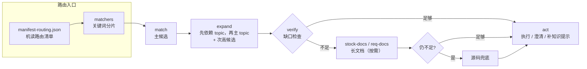
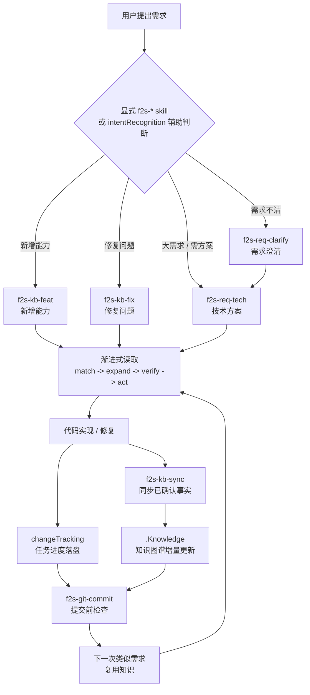
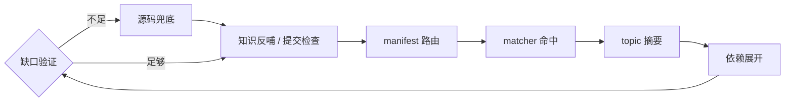

# Flow2Spec：让项目在开发中自然长出知识图谱


---

## 一、前言


最近一年，很多 AI 编程工具都在解决同一个问题：**让 Agent 记住项目上下文。**

这件事当然重要。但现在只说"项目记忆""上下文管理""规则文件"，已经不够了。

因为很多开源项目都在做类似的事：写一个 `AGENTS.md` / `CLAUDE.md`，加一组 rules，建一个 docs 目录，让 Agent 先读项目说明，或者接入向量库做检索。

这些方案能缓解问题，但我真正想解决的不是"启动时塞给 AI 一堆上下文"。我想解决的是：

**在真实开发过程中，项目知识能不能被持续沉淀、自动路由、持续验证，并且随着代码一起演进。**

这就是 Flow2Spec。一句话介绍：**Flow2Spec 是一个让项目在开发过程中自然长出知识图谱的 Agent 工程框架。**

---

## 二、只做"记忆"为什么不够


很多项目接入 AI 后，会很快遇到一个悖论：你希望 AI 多了解项目，但你给它的上下文越多，它越容易读不完、读偏、忘掉重点。

于是大家不断加规则：先读这个文件，再读那个目录，这个模块不能改，那个接口有历史兼容，改完记得更新文档……最后上下文变成另一种负担。它看起来像知识库，实际上更像一个不断膨胀的说明书。

Flow2Spec 的判断是：**项目知识不能只靠"写下来"，还要能被路由、被组合、被校验、被持续更新。**

---

## 三、Flow2Spec 的关键差异：开发过程生成知识图谱


Flow2Spec 不是要求你先做一场大规模文档工程。它更推荐的方式是：

1. 先 `flow2spec init` 初始化一个空骨架

2. 用 `f2s-doc-arch` 生成项目架构说明，沉淀进知识库

3. 真实需求来了，Agent 先按现有知识路由

4. 功能实现后，用 `f2s-kb-sync` 把本轮确认的事实同步回知识库

5. 下一次类似需求，再从这份知识中渐进读取

**知识不是一次性建设出来的。它是在需求澄清、技术方案、代码实现、修复问题、知识同步、提交代码的过程中逐步长出来的。**

这也是 Flow2Spec 和普通"项目记忆文件"的区别：普通方案更像给 Agent 一份说明书；Flow2Spec 更像给项目维护一张可演进的知识图谱——落在仓库里的 `.Knowledge/` 中，能 diff、能 review、能随代码提交。

---

## 四、知识库接口：不是一个大文档，而是一套路由协议


Flow2Spec 的知识库有一个明确的接口结构：

```Plain Text
.Knowledge/
  manifest-routing.json   # 机读路由清单
  matchers/               # 关键词分片
  topics/                 # 主题摘要
  stock-docs/             # 已落地能力长文档
  req-docs/               # 需求 / 技术方案文档

```

Agent 的读取顺序不是自由发挥，而是按协议走：

```Plain Text
manifest-routing.json
  -> matcher 分片（matcherPath 指向的单个文件）
  -> match（主候选）
  -> expand（先依赖 topic，再主 topic；保留次高候选）
  -> verify（缺口检查）
      -> 足够：act
      -> 不足：stock-docs / req-docs（按需）
          -> 仍不足：源码兜底
          -> act 或澄清
```

图 1：知识库渐进式读取



这套结构的价值在于：**知识库对 Agent 暴露的不是"文件"，而是"怎么找到正确知识"的接口。**

`manifest-routing.json` 告诉 Agent 有哪些主题；`matchers/*.json` 告诉 Agent 这个需求可能命中哪些主题；`topics/*.md` 给 Agent 短摘要和硬约束；`topicDependencies` 告诉 Agent 哪些前置规则必须一起读；`stock-docs/` 和 `req-docs/` 只在需要时下钻。

---

## 五、渐进式读取：AI 每次只拿该拿的知识


Flow2Spec 的读取模型可以概括成四步：**match → expand → verify → act**

**match**：Agent 先读 `manifest-routing.json`，再按任务读取对应 matcher 分片。不遍历整个知识库，先缩小候选范围。

**expand**：命中主主题后，通过 `topicDependencies` 继续读取依赖主题，避免只看到局部规则。比如一个功能可能同时依赖公共配置规则、鉴权规则、某个业务模块的约束。

**verify**：命中 topic 不代表知识一定够。Flow2Spec 要求 Agent 在执行前检查：当前主题是否真的覆盖用户问题，是否缺关键依赖，是否需要读长文档，是否需要先反问用户。这一步把"看起来命中了"变成"确认可以执行"。

**act**：只有在知识覆盖足够、边界清楚时，Agent 才进入实现、修改或提交。如果置信度不足，就先澄清，而不是硬改。

---

## 六、多依赖能力：不让 Agent 只读到一半规则


真实项目里，很多错误不是因为 AI 完全没读知识，而是它只读了一个局部知识，漏掉了前置约束：

- 改功能时读了业务 topic，但没读提交规则

- 生成技术方案时读了需求文档，但没读 req\-docs / stock\-docs 的边界规则

- 修改配置时读了模块说明，但没读配置开关默认值

Flow2Spec 把这些依赖显式放进路由层。一个 topic 可以声明它依赖哪些 topic，Agent 命中主主题时会先展开依赖。这不是简单的"多读几个文件"，而是把项目知识从扁平文档变成有边的图：

```Plain Text
需求实现
  -> 文档路由规则
  -> 技术方案规则
  -> 任务追踪规则
  -> Git 提交规则

```

这让 Agent 每次读取的不是孤立片段，而是一组经过声明的上下文组合。

---

## 七、知识库正确性：不是写了 topic 就算完


知识库最怕两件事：过期和写错。Flow2Spec 没有假设知识库永远正确，它把"验证"放进了开发流程。

典型场景：用户问一个业务细节，Agent 先查知识库，发现 topic 有覆盖但不够细，继续读源码得到更准确的事实。这时 Flow2Spec 不应该只回答完就结束，还要判断：

- 这个事实是否已经写进 topic

- 如果没写，是否应该提示 `f2s-kb-sync`

- 如果整个模块没入库，是否应该提示 `f2s-kb-add <路径>`

- 如果知识看起来已覆盖，是否能证明覆盖来源；不能证明就不能静默

这就是"知识库补充建议收口"。**它让 AI 从源码里找到的每次新知识，都不只留在本次聊天里，而是反哺回知识库。**

---

## 八、用户意图识别：不是所有话都应该自动进流程


用户说一句话，Agent 到底应该回答、讨论、澄清，还是直接进开发流程？

- "这个方案可行吗？" → 应该是讨论，不应该自动开始写代码

- "修一下这个 bug" → 应该进入 fix 流程

- "我想做一个新能力，先帮我把需求问清楚" → 应该进入需求澄清，而不是直接实现

Flow2Spec 里有 `intentRecognition` 开关，开启后 Agent 会按意图识别规则做辅助判断：高置信新增能力进入 feat 流程，高置信修复问题进入 fix 流程，需求不清楚进入 req\-clarify，只是询问/讨论则保持普通对话。

不过**现阶段更推荐用户显式使用 f2s\-\* skill**，例如直接输入 `f2s-req-clarify`、`f2s-kb-feat`、`f2s-kb-fix`。显式命令比自动意图识别更稳定，也更容易让用户知道当前正在走哪条流程。

---

## 九、一个更真实的开发闭环


使用 Flow2Spec 后，一个需求可能是这样流动的：

```Plain Text
用户提出需求
  -> 显式 f2s-* skill / intentRecognition 辅助判断
  -> f2s-req-clarify 反问到无歧义
  -> f2s-req-tech 生成技术方案
  -> Agent 按知识库渐进读取
  -> 实现代码
  -> changeTracking 记录任务进度
  -> f2s-kb-sync 同步新知识
  -> f2s-git-commit 提交前检查

```

图 2：开发过程生成知识图谱



这条链路里，每一步都会留下可追踪的资产：需求文档在 `req-docs/`，已落地知识在 `stock-docs/`，主题摘要在 `topics/`，路由关系在 `manifest-routing.json`，任务进度在 `.task/`。

**Flow2Spec 做的不是"让 AI 单次回答更好"，而是在把一次次开发过程转化为项目知识图谱的增量更新。**

---

## 十、它不只管知识，也管开发闭环


**任务进度落盘**：开启 `changeTracking` 后，Agent 执行功能开发或方案实现时，会把任务 checklist 写到 `.task/`。新会话继续做时，不需要重新问"上次做到哪"，直接从磁盘任务接上。

**技术方案不硬套模板**：`f2s-req-tech` 会根据当前需求选择合适的技术方案结构，而不是把所有章节机械套一遍，避免前端改造也生成一堆数据库章节。

**多 Agent 编排与校验**：复杂任务可以通过 `subAgent` 拆给子 Agent 处理。如果开启 `switchAgentVerification`，还可以让写入方和验证方分离，降低单个 Agent 自己写、自己验、自己放过的风险。

**提交前知识覆盖检查**：`f2s-git-commit` 会在提交前检查 diff、冲突标记、暂存范围，也会检查本轮变更是否需要同步知识库，让"改代码后忘记更新知识"在提交前能被发现。

**模板与路由升级检测**：Flow2Spec 启动时会检测 `.Knowledge/` 结构版本，如果落后于 npm 包版本，Agent 会提示执行 `f2s-kb-upgrade`，确保项目知识结构与工具版本保持同步。

---

## 十一、和普通知识库最大的区别


如果只用一句话概括差异：**普通知识库是给 Agent 查的；Flow2Spec 的知识库是给 Agent 参与维护的。**

图 3：普通记忆文件 vs Flow2Spec 知识图谱




普通知识库关注：文档放在哪里、怎么检索、怎么总结。

Flow2Spec 更关注：需求来了该读哪个主题、主题之间有什么依赖、当前知识是否足够执行、源码兜底后是否要反哺、用户意图是否应该触发流程、改代码后知识是否一起更新、提交前是否检查过知识覆盖。

这也是为什么 Flow2Spec 会同时包含 `.Knowledge/`、`.task/`、`f2s-*` skills、Agent rules 和 `flow2spec.config.json`——它们不是散件，而是一套围绕开发闭环组织起来的协议。

---

## 十二、几个常见问题


**Q：改动一个能力后，怎么保证对应主题都能更新？**

Flow2Spec 不承诺「模型一定自动知道所有影响面」，而是把影响面发现变成一套可执行流程。

一次能力改动通常不只对应一个 topic。例如改了「批量重评分」，可能同时影响：

| 类型 | 需检查的内容 |
| --- | --- |
| 业务能力 topic | 这个功能现在怎么工作 |
| 配置 topic | 开关、默认值、阈值有没有变化 |
| 规则 topic | 幂等、锁、错误码、提交前检查有没有变化 |
| 模块 topic | 公共方法、目录边界、调用链有没有变化 |

Flow2Spec 通过五层机制提高覆盖率：

1. 路由层：matcher 找主 topic
2. 依赖展开：`topicDependencies` 展开依赖 topic
3. 同步确认：`f2s-kb-sync` 先给出更新大纲，让用户确认
4. 问答收口：普通问答下钻源码后，发现缺口则提示补充
5. 提交门禁：`f2s-git-commit` 提交前做知识覆盖检查

**举例**：改「活动抽奖次数」时，知识更新不应只写「抽奖接口改了」，还可能要同步：

- 活动业务 topic：抽奖次数怎么计算
- 数据模型 topic：哪些字段记录已领取 / 剩余次数
- 规则 topic：浏览任务、购买任务、重复领取的限制
- 配置 topic：奖品列表、开关、活动时间

> Flow2Spec 的目标不是让 Agent 凭感觉改一个文件，而是先列出「这次变更可能影响哪些主题」，确认后再落盘。

---

**Q：Flow2Spec 怎么解决 Agent 遗忘规则的问题？**

分两侧看：**下游项目使用侧** 与 **Flow2Spec 自身设计侧**。

#### 下游使用侧

下游项目最常见的问题是：新开会话 Agent 不记得规则，或读了规则却只读到一部分。

Flow2Spec 的做法是把规则拆成可路由、可依赖的结构，而不是塞进一个超长文件：

- 入口规则 → `AGENTS.md` / `.cursor` / `.claude` / `.codex`
- 业务知识 → `.Knowledge/topics/`
- 匹配词 → `.Knowledge/matchers/`
- 主题依赖 → `topicDependencies`
- 长文档 → `stock-docs/`、`req-docs/`

Agent 每次不靠记忆，而是按 `match → expand → verify → act` 重新取规则——写代码读实现 topic、出方案读技术方案规则、提交读 git 规则、问答下钻后读知识库收口规则。

#### Flow2Spec 设计侧

五层约束分阶段拦截「规则写了但不遵守」：

| 层级 | 做什么 |
| --- | --- |
| 入口层 | `AGENTS.md` / 各端 rules 声明读取顺序、禁止项、渐进式读取原则 |
| 配置层 | 执行任何 `f2s-*` 技能前必须先读 `flow2spec.config.json` |
| 路由层 | 先读 `manifest-routing.json`，再按 matcher / topic 读取，不直接全仓搜索 |
| 技能层 | 每个 `f2s-*` 技能定义前置检查、确认点、落盘步骤和收口方式 |
| 门禁层 | 任务归档（`f2s-task`）、知识落盘（`f2s-kb-sync`）、问答收口（`f2s-kb-feedback-closing`）、代码提交（`f2s-git-commit`）分别设门禁 |

**案例一：防止意图误判**

用户还在需求澄清阶段，只是在讨论「这个能力是不是应该这样做」。若 Agent 只看到「新增能力」几个字，就可能误触发 `f2s-kb-feat` 直接实现。

Flow2Spec 的约束：

1. 先看 `intentRecognition` 是否开启
2. 判断当前输入是讨论、澄清，还是明确要求执行
3. 需求澄清未结束 → 不能跳到 `f2s-kb-feat`
4. 信息不足 → 继续 `f2s-req-clarify`，不生成方案、不写代码

**案例二：防止源码答完后知识不反哺**

用户问业务细节，Agent 读了知识库但 topic 未覆盖，下钻源码找到答案。最容易出现的偷懒路径：

- 跳过知识库，直接全仓搜源码
- 从源码答完就结束
- 只说「建议后续补充文档」，不给明确命令
- 发现知识缺口，却在最后静默掉

Flow2Spec 用六条限制把这些路堵死：

1. 下钻源码前必须先读 `manifest-routing.json` 和命中 topic
2. 关键事实来自源码 → 标记为源码兜底
3. 结束回答前判断：模块未入库，还是已入库但细节缺失
4. 未入库 → 只提示 `f2s-kb-add <模块路径>`
5. 已入库但细节缺失 → 只提示 `f2s-kb-sync <主题或能力说明>`
6. 判断知识已覆盖 → 必须能说明覆盖来源；不能证明就不能静默

> Flow2Spec 不是指望 Agent 自觉，而是把「答完就跑」的出口尽量堵住——规则拆到入口、配置、路由、技能和提交门禁里，让 Agent 在不同阶段都能重新取回对应约束。

---

**Q：单个主题文件过大怎么办？**

topic 的定位是「路由摘要」：记触发词、边界、关键约束和下一步指针，不承载所有细节。长内容放 `stock-docs/`；大功能拆成多个 focused topic，再用 `topicDependencies` 串起来。

**拆分示例**（一万行代码的大功能）：

```text
topics/
  活动概览.md
  活动任务规则.md
  活动数据模型.md
  活动外部依赖.md

stock-docs/
  活动概述_终稿.md
  活动任务规则_终稿.md
  活动数据模型_终稿.md
  活动外部依赖_终稿.md
```

Agent 先读「活动概览」判断相关性；问任务状态机 → 读「活动任务规则」；问表字段 → 读「活动数据模型」。

这样可避免：topic 太大读不完抓不住重点，或触发词太杂导致一个主题什么需求都命中。

---

**Q：如果知识库没有覆盖当前模块怎么办？**

Agent 通过源码找到答案但知识库没覆盖时，不应只把答案告诉你，还应提示下一步命令：

| 场景 | 命令 | 适用情况 |
| --- | --- | --- |
| 模块未入库 | `f2s-kb-add <模块路径>` | 把整个模块解析入库 |
| 已入库但细节缺失 | `f2s-kb-sync <主题或能力说明>` | 同步本轮确认的新事实 |

> 每次「从源码里找答案」，都可能变成一次知识库补强。

---

## 十三、适合什么项目 \+ 快速体验


**最适合**：中大型业务项目、长期维护的代码仓库、多人协作规则很多的项目、经常使用 Cursor / Claude Code / Codex 的团队、希望 AI 不只是"看文档"而是参与维护项目知识的场景。

**可能不适合**：一次性脚本或非常小的个人项目（\< 5000 行，一份 README 够用）。

**5 分钟快速体验**：

```Plain Text
npx @double-codeing/flow2spec@latest init

```

开始使用时建议优先显式输入 `f2s-*` skill，等熟悉流程后再按需开启 `intentRecognition` 自动分流。

常用流程：

```Plain Text
/f2s-req-clarify   需求澄清
/f2s-req-tech      生成技术方案
/f2s-kb-feat       新增能力并同步知识
/f2s-kb-fix        修复问题并修正知识
/f2s-kb-add <路径>  解析已有模块入库
/f2s-kb-sync       同步本轮新增事实
/f2s-git-commit    提交前检查并生成提交信息

```

目前已支持 Cursor、Claude Code、Codex 三端初始化，也支持中文 / 英文模板。

---

## 结语


AI 编程的终点不是"写更多代码"。真正难的是：**让 AI 在长期项目里持续理解上下文，并且把每次开发产生的新知识沉淀下来。**

Flow2Spec 把项目知识从静态文档变成可路由、可依赖、可验证、可反哺的知识图谱。它让 Agent 不只是消费上下文，也参与维护上下文。

如果你的项目已经出现"每次都要给 AI 解释同一套业务规则"、"AI 经常漏读前置约束"、"文档和代码越来越不同步"这类问题，可以试一下：

```Plain Text
npx @double-codeing/flow2spec@latest init
```

开源地址：`https://github.com/Lands-1203/Flow2Spec`

PPT演示：`https://lands-1203.github.io/Flow2Spec/`

---


觉得 Flow2Spec 对你有帮助的话，欢迎去 GitHub 点个 Star，你的支持是持续开发的动力！

👉 **https://github\.com/Lands\-1203/Flow2Spec**

---