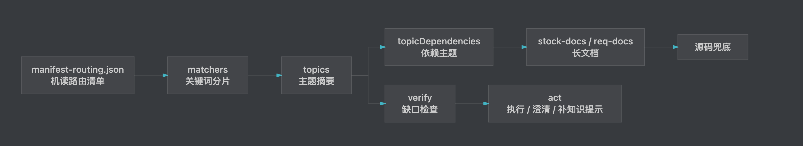
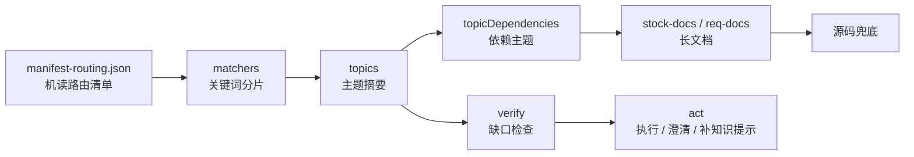
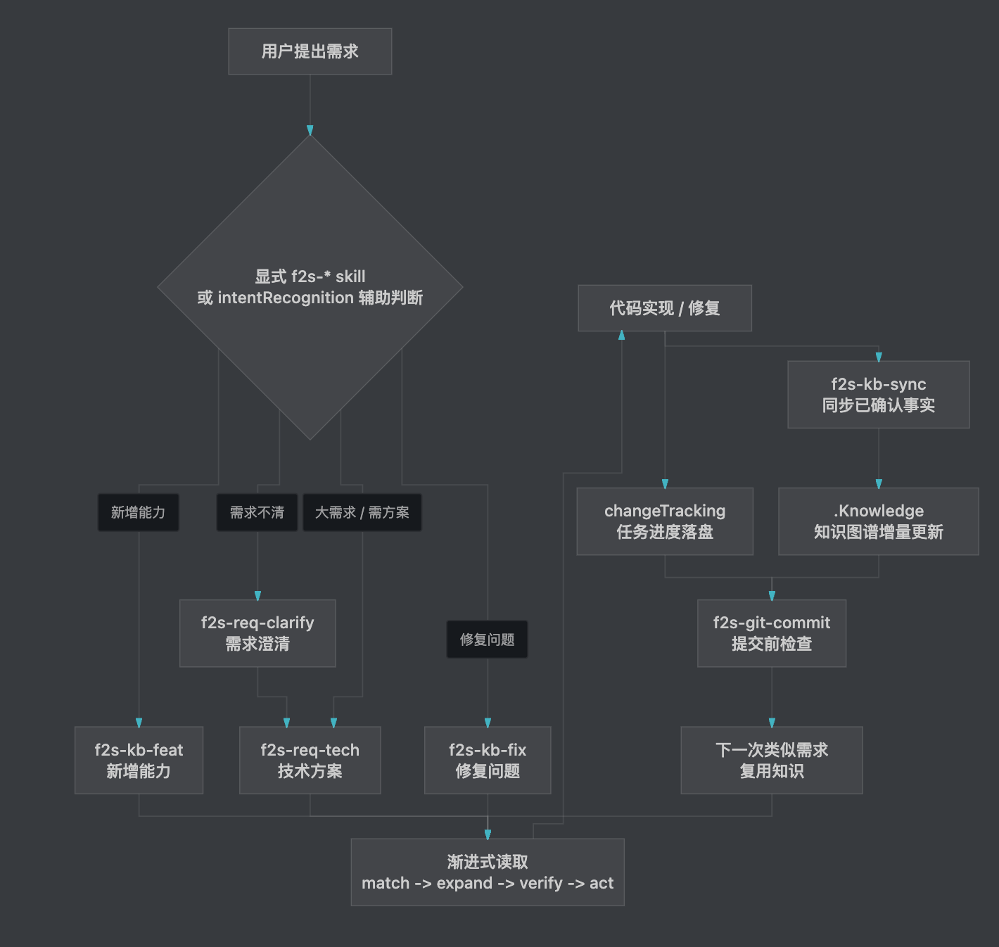
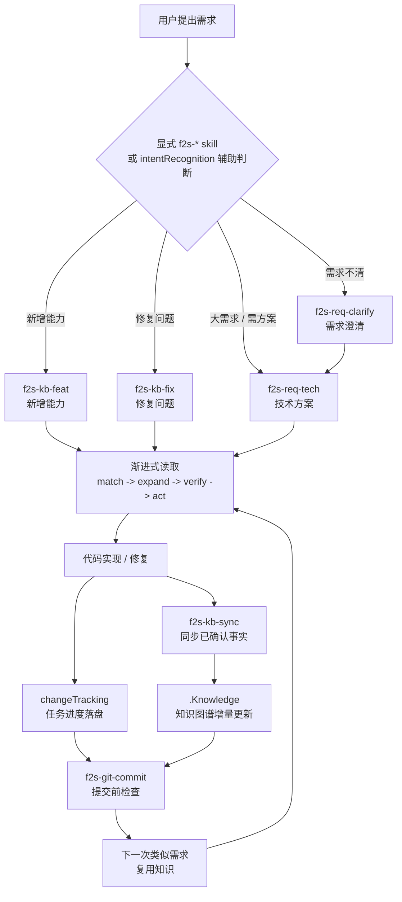
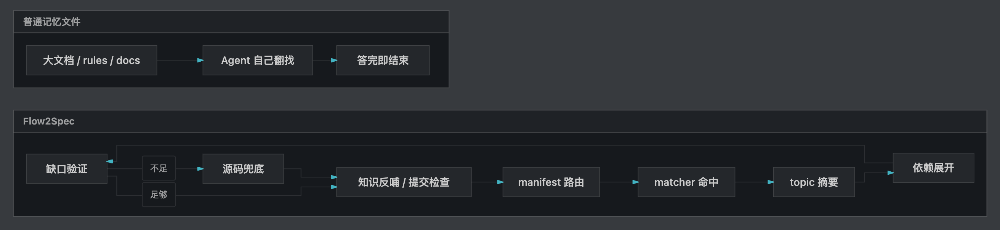
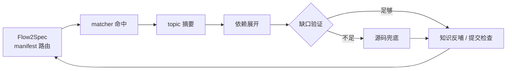

# AI 写代码不缺上下文，缺的是会在开发中生长的项目知识图谱

## 一、前言

最近一年，很多 AI 编程工具都在解决同一个问题：

**让 Agent 记住项目上下文。**

这件事当然重要。  
但现在只说“项目记忆”“上下文管理”“规则文件”，已经不够了。

因为很多开源项目都在做类似的事：

- 写一个 `AGENTS.md` / `CLAUDE.md`
- 加一组 rules
- 建一个 docs 目录
- 让 Agent 先读项目说明
- 或者接入向量库做检索

这些方案能缓解问题，但我真正想解决的不是“启动时塞给 AI 一堆上下文”。

我想解决的是：

**在真实开发过程中，项目知识能不能被持续沉淀、自动路由、持续验证，并且随着代码一起演进。**

这就是 Flow2Spec。

一句话介绍：

**Flow2Spec 是一个让项目在开发过程中自然长出知识图谱的 Agent 工程框架。**

它不是静态文档库。  
它的核心不是“把资料放进去”，而是让需求、技术方案、代码变更、知识补充、任务进度在同一条开发链路里闭环。

---

## 二、只做“记忆”为什么不够

很多项目接入 AI 后，会很快遇到一个悖论：

你希望 AI 多了解项目。  
但你给它的上下文越多，它越容易读不完、读偏、忘掉重点。

于是大家会不断加规则：

- 先读这个文件
- 再读那个目录
- 这个模块不能改
- 那个接口有历史兼容
- 改完记得更新文档

最后上下文变成另一种负担。

它看起来像知识库，实际上更像一个不断膨胀的说明书。  
Agent 每次都要在说明书里找答案，找不到就全仓搜索，搜完又不一定知道哪些信息应该反哺回去。

Flow2Spec 的判断是：

**项目知识不能只靠“写下来”，还要能被路由、被组合、被校验、被持续更新。**

---

## 三、Flow2Spec 的关键差异：开发过程生成知识图谱

Flow2Spec 不是要求你先做一场大规模文档工程。

它更推荐的方式是：

1. 先 `flow2spec init` 初始化一个空骨架。
2. 用 `f2s-doc-arch` 生成项目架构说明，再按流程把项目的整体结构沉淀进知识库。
3. 真实需求来了，Agent 先按现有知识路由，不急着全仓搜索。
4. 如果你已经知道当前迭代模块还没入库，就先用 `f2s-kb-add <模块路径>` 解析这个模块。
5. 如果开发过程中发现知识缺失，Agent 再提示通过代码或需求文档补齐。
6. 功能实现后，用 `f2s-kb-sync` 把本轮已确认的事实同步回知识库；如果忘记做，提交前检查或后续问答收口会再次暴露这个缺口。
7. 下一次类似需求，再从这份知识中渐进读取。

也就是说，知识不是一次性建设出来的。

**它是在需求澄清、技术方案、代码实现、修复问题、知识同步、提交代码的过程中逐步长出来的。**

这也是 Flow2Spec 和普通“项目记忆文件”的区别。

普通方案更像给 Agent 一份说明书。  
Flow2Spec 更像给项目维护一张可演进的知识图谱：

- 主题是什么
- 主题依赖哪些规则
- 触发词是什么
- 该读哪个摘要
- 什么时候需要下钻长文档
- 哪些知识已经覆盖
- 哪些知识需要补充

这些信息不是散在聊天记录里，而是落在仓库里的 `.Knowledge/` 中，能 diff、能 review、能随代码提交。

---

## 四、知识库接口：不是一个大文档，而是一套路由协议

Flow2Spec 的知识库不是“把 Markdown 堆在一起”。

它有一个明确的接口结构：

```text
.Knowledge/
  manifest-routing.json   # 机读路由清单
  matchers/               # 关键词分片
  topics/                 # 主题摘要
  stock-docs/             # 已落地能力长文档
  req-docs/               # 需求 / 技术方案文档
```

Agent 的读取顺序不是自由发挥，而是按协议走：

```text
manifest-routing.json
  -> matcher 分片
  -> topic 摘要
  -> topicDependencies
  -> stock-docs / req-docs
  -> 源码兜底
```

图 1：知识库渐进式读取



<details>
<summary>查看图 1 Mermaid 源码</summary>



</details>

这套结构的价值在于：

**知识库对 Agent 暴露的不是“文件”，而是“怎么找到正确知识”的接口。**

`manifest-routing.json` 告诉 Agent 有哪些主题。  
`matchers/*.json` 告诉 Agent 这个需求可能命中哪些主题。  
`topics/*.md` 给 Agent 短摘要和硬约束。  
`topicDependencies` 告诉 Agent 哪些前置规则必须一起读。  
`stock-docs/` 和 `req-docs/` 只在需要时下钻。

另外，Flow2Spec 还支持给 topic 标注主题类型。

比如一个 topic 可以被标记为：

- `feature`：已落地的业务 / 产品能力
- `module`：公共模块、目录结构、工程边界
- `config`：配置项、开关、默认值
- `policy`：流程、规则、约束、门禁

这类 `topicMetadata` 不直接参与 matcher 命中，也不替代 topic 正文里的约束。  
它更像一层阅读预期和治理元数据：让 Agent 知道这个主题应该重点看业务能力、模块边界、配置，还是流程规则；也方便后续做知识库盘点、审计和主题膨胀检查。

这让 Agent 不需要每次全仓搜索，也不需要一次性读完所有规则。

---

## 五、渐进式读取：AI 每次只拿该拿的知识

Flow2Spec 的读取模型可以概括成四步：

```text
match -> expand -> verify -> act
```

### match：先命中主题

Agent 先读 `manifest-routing.json`，再按任务读取对应 matcher 分片。  
它不是遍历整个知识库，而是先缩小候选范围。

### expand：再展开依赖

很多真实业务不是单点知识。

比如一个功能可能同时依赖：

- 公共配置规则
- 鉴权规则
- 某个业务模块
- 某个提交约束
- 某个技术方案流程

Flow2Spec 通过 `topicDependencies` 把这些关系显式写出来。  
Agent 命中主主题后，会继续读取依赖主题，避免只看到局部规则。

### verify：执行前做缺口检查

命中 topic 不代表知识一定够。

Flow2Spec 要求 Agent 在执行前检查：

- 当前主题是否真的覆盖用户问题
- 是否缺关键依赖
- 是否需要读长文档
- 是否需要下钻源码
- 是否需要先反问用户

这一步很关键。  
它把“看起来命中了”变成“确认可以执行”。

### act：置信度足够才行动

只有在知识覆盖足够、边界清楚时，Agent 才进入实现、修改或提交。  
如果置信度不足，就先澄清，而不是硬改。

---

## 六、多依赖能力：不让 Agent 只读到一半规则

真实项目里，很多错误不是因为 AI 完全没读知识。  
而是它只读了一个局部知识，漏掉了前置约束。

比如：

- 改功能时读了业务 topic，但没读提交规则。
- 生成技术方案时读了需求文档，但没读 req-docs / stock-docs 的边界规则。
- 修改配置时读了模块说明，但没读配置开关默认值。
- 做任务规划时读了实现步骤，但没读 `.task/` 追踪规则。

Flow2Spec 把这些依赖显式放进路由层。

一个 topic 可以声明它依赖哪些 topic。  
Agent 命中主主题时，会先展开依赖，再读主主题。

这不是简单的“多读几个文件”。  
它的意义是把项目知识从扁平文档变成有边的图：

```text
需求实现
  -> 文档路由规则
  -> 技术方案规则
  -> 任务追踪规则
  -> Git 提交规则
```

这种图结构是 Flow2Spec 的核心之一。  
它让 Agent 每次读取的不是一个孤立片段，而是一组经过声明的上下文组合。

---

## 七、知识库正确性：不是写了 topic 就算完

知识库最怕两件事：

1. 过期。
2. 写错。

Flow2Spec 没有假设知识库永远正确。  
它把“验证”放进了开发流程。

典型场景是普通问答：

用户问一个业务细节。  
Agent 先查知识库，发现 topic 有覆盖，但答案还不够细。  
它继续读源码，得到了更准确的事实。

这时 Flow2Spec 不应该只回答完就结束。  
它还要判断：

- 这个事实是否已经写进 topic
- 如果没写，是否应该提示 `f2s-kb-sync`
- 如果整个模块没入库，是否应该提示 `f2s-kb-add <路径>`
- 如果知识看起来已覆盖，是否能证明覆盖来源；不能证明就不能静默

这就是“知识库补充建议收口”。

它解决的是一个很实际的问题：

**AI 从源码里找到了新知识，但这份知识不能只留在本次聊天里。**

否则下一次又会重新查源码。

Flow2Spec 希望每次代码下钻都变成一次知识库质量检查。  
答完问题以后，如果发现知识缺口，就给出明确的补充命令；如果已经覆盖，就不打扰用户。

---

## 八、用户意图识别：不是所有话都应该自动进流程

另一个容易被忽略的问题是：用户说一句话，Agent 到底应该回答、讨论、澄清，还是直接进开发流程？

比如：

```text
这个方案可行吗？
```

这应该是讨论，不应该自动开始写代码。

再比如：

```text
修一下这个 bug
```

这可能应该进入 fix 流程。

又比如：

```text
我想做一个新能力，先帮我把需求问清楚
```

这应该进入需求澄清，而不是直接生成技术方案，也不是直接实现。

Flow2Spec 里有 `intentRecognition` 开关。  
开启后，Agent 会按意图识别规则做辅助判断：

- 高置信新增能力 -> 进入 feat 类流程
- 高置信修复问题 -> 进入 fix 类流程
- 需求不清楚 -> 进入 req-clarify
- 只是询问 / 讨论 / 评估 -> 保持普通对话
- 当前流程还没结束 -> 不得误切到新流程

这点很重要。

很多自动化失败，不是因为工具不会执行，而是因为它太积极了。  
Flow2Spec 的目标不是“任何话都自动跑技能”，而是让 Agent 在合适的时候进入合适的流程。

不过这部分我还在持续验证。  
现阶段更推荐用户显式使用 `f2s-*` skill，例如直接输入 `f2s-req-clarify`、`f2s-kb-feat`、`f2s-kb-fix`。  
显式命令比自动意图识别更稳定，也更容易让用户知道当前正在走哪条流程。

---

## 九、一个更真实的开发闭环

使用 Flow2Spec 后，一个需求可能是这样流动的：

```text
用户提出需求
  -> 显式 f2s-* skill / intentRecognition 辅助判断
  -> f2s-req-clarify 反问到无歧义
  -> f2s-req-tech 生成技术方案
  -> Agent 按知识库渐进读取
  -> 实现代码
  -> changeTracking 记录任务进度
  -> f2s-kb-sync 同步新知识
  -> f2s-git-commit 提交前检查
```

图 2：开发过程生成知识图谱



<details>
<summary>查看图 2 Mermaid 源码</summary>



</details>

这条链路里，每一步都会留下可追踪的资产：

- 需求文档在 `req-docs/`
- 已落地知识在 `stock-docs/`
- 主题摘要在 `topics/`
- 路由关系在 `manifest-routing.json`
- 任务进度在 `.task/`
- 执行规则在各端 Agent 配置中

所以 Flow2Spec 做的不是“让 AI 单次回答更好”。  
它是在把一次次开发过程转化为项目知识图谱的增量更新。

---

## 十、它不只管知识，也管开发闭环

知识图谱只是 Flow2Spec 的一部分。  
如果只沉淀知识，但任务、校验、提交和升级都散在外面，Agent 还是很容易在长流程里断掉。

所以 Flow2Spec 还补了几块开发侧能力。

### 任务进度落盘

开启 `changeTracking` 后，Agent 执行功能开发或方案实现时，会把任务 checklist 写到 `.task/`。  
新会话继续做时，不需要重新问“上次做到哪”，直接从磁盘任务接上。

用户侧待办也可以和 Agent 步骤分开记录。  
比如执行 SQL、配置环境变量、确认线上开关，这些不应该混在 Agent 自己的任务里。

### 技术方案不硬套模板

`f2s-req-tech` 会根据当前需求选择合适的技术方案结构。  
它不是把所有章节机械套一遍，而是按需求类型决定是否需要写流程、数据、配置、消息队列、前端交互、接口契约等内容。

这能避免一个常见问题：明明是前端交互或工具链改造，却生成一份充满“接口”“数据库”“后端配置”的模板化方案。

### 多 Agent 编排与校验

复杂任务可以通过 `subAgent` 拆给子 Agent 处理，主 Agent 负责统筹、汇总和最终判断。  
如果开启 `switchAgentVerification`，还可以让写入方和验证方分离，降低单个 Agent 自己写、自己验、自己放过的风险。

### 提交前知识覆盖检查

`f2s-git-commit` 不只是生成 commit message。  
它会在提交前检查 diff、冲突标记、暂存范围，也会在默认模式下检查本轮变更是否需要同步知识库。

这让“改代码后忘记更新知识”变成提交前可以被发现的问题。

### 模板与路由升级检测

Flow2Spec 还支持启动时检测知识库模板版本。  
如果当前项目里的 `.Knowledge` 结构落后于 npm 包版本，Agent 会提示执行 `f2s-kb-upgrade`，让下游项目继续对齐最新的路由结构和规则模板。

这些能力放在一起，Flow2Spec 才不只是一个知识目录，而是一套围绕 Agent 开发流程的闭环。

---

## 十一、和普通知识库最大的区别

如果只用一句话概括差异，我会这样说：

**普通知识库是给 Agent 查的；Flow2Spec 的知识库是给 Agent 参与维护的。**

图 3：普通记忆文件 vs Flow2Spec 知识图谱



<details>
<summary>查看图 3 Mermaid 源码</summary>




</details>

普通知识库关注：

- 文档放在哪里
- 怎么检索
- 怎么总结

Flow2Spec 更关注：

- 需求来了该读哪个主题
- 主题之间有什么依赖
- 当前知识是否足够执行
- 源码兜底后是否要反哺
- 用户意图是否应该触发流程
- 改代码后知识是否一起更新
- 提交前是否检查过知识覆盖

这也是为什么 Flow2Spec 会同时包含：

- `.Knowledge/`
- `.task/`
- `f2s-*` skills
- Agent rules
- `flow2spec.config.json`

它们不是散件，而是一套围绕开发闭环组织起来的协议。

---

## 十二、几个常见问题

### 改动一个能力后，怎么保证对应主题都能更新？

Flow2Spec 不承诺“模型一定自动知道所有影响面”。  
它做的是把影响面发现变成一套可执行流程。

一次能力改动通常不是只对应一个 topic。  
比如改了“批量重评分”，可能同时影响：

- 业务能力 topic：这个功能现在怎么工作
- 配置 topic：开关、默认值、阈值有没有变化
- 规则 topic：幂等、锁、错误码、提交前检查有没有变化
- 模块 topic：公共方法、目录边界、调用链有没有变化

Flow2Spec 会通过几层机制提高覆盖率：

1. 路由层先根据 matcher 找到主 topic。
2. `topicDependencies` 展开依赖 topic，避免只更新局部知识。
3. `f2s-kb-sync` 要先给出更新大纲，让用户确认哪些主题需要改。
4. 普通问答下钻源码后，如果发现 topic 没写全，会提示补充。
5. `f2s-git-commit` 默认会做知识覆盖检查，避免代码提交时漏掉知识同步。

举个例子：

如果你改了一个“活动抽奖次数”的能力，知识更新不应该只写“抽奖接口改了”。  
它还可能要更新：

- 活动业务 topic：抽奖次数怎么计算
- 数据模型 topic：哪些字段记录已领取 / 剩余次数
- 规则 topic：浏览任务、购买任务、重复领取的限制
- 配置 topic：奖品列表、开关、活动时间

Flow2Spec 的目标不是让 Agent 凭感觉改一个文件，而是让它先列出“这次变更可能影响哪些主题”，确认后再落盘。

### Flow2Spec 怎么解决 Agent 遗忘规则的问题？

这个问题要分两侧看：**下游项目使用侧**和 **Flow2Spec 自身设计侧**。

**先看下游使用侧。**

下游项目最常见的问题是：新开一个会话，Agent 不记得项目规则；或者它虽然读了规则，但只读到一部分。

Flow2Spec 的做法不是把所有规则塞进一个超长文件，而是把规则拆成可路由、可依赖的知识：

- 项目入口规则写进 `AGENTS.md` / `.cursor` / `.claude` / `.codex`
- 业务知识放进 `.Knowledge/topics/`
- 匹配词放进 `.Knowledge/matchers/`
- 主题依赖放进 `topicDependencies`
- 长文档放进 `stock-docs/` 或 `req-docs/`

Agent 每次不是凭记忆行动，而是按 `match -> expand -> verify -> act` 重新取规则。

比如：

- 写代码时，读取实现相关 topic
- 生成技术方案时，读取技术方案规则和需求文档边界
- 提交代码时，读取 git 提交规则
- 普通问答下钻源码后，读取知识库补充建议收口规则

这样做解决的是“规则散、规则长、规则读不全”的问题。

**再看 Flow2Spec 自身设计侧。**

Flow2Spec 自己也有一套分层约束，尽量减少“规则写了但 Agent 不遵守”：

1. 入口层：`AGENTS.md` / 各端 rules 先声明读取顺序、禁止项和渐进式读取原则。
2. 配置层：执行任何 `f2s-`* 技能前，必须先读 `flow2spec.config.json`，确认 `subAgent`、`switchAgentVerification`、`intentRecognition` 等开关。
3. 路由层：普通问答和开发任务都先读 `manifest-routing.json`，再按 matcher / topic 读取，而不是直接全仓搜索。
4. 技能层：每个 `f2s-*` 技能定义自己的前置检查、用户确认点、落盘步骤和收口方式。
5. 门禁层：`f2s-git-commit` 在提交前再检查 diff、冲突和知识覆盖，避免前面漏掉的规则直接进 Git。

举个容易出错的案例：

用户还在需求澄清阶段，只是在讨论“这个能力是不是应该这样做”。  
如果 Agent 只看到“新增能力”几个字，就可能误触发 `f2s-kb-feat`，直接开始实现。

Flow2Spec 的约束是：

1. 先看 `intentRecognition` 是否开启。
2. 判断当前输入是讨论、澄清，还是明确要求执行。
3. 如果当前需求澄清流程未结束，就不能跳到 `f2s-kb-feat`。
4. 信息不足时继续走 `f2s-req-clarify`，而不是生成技术方案或写代码。

再举一个知识缺失提示的例子。

用户问一个业务细节，Agent 先读了知识库，但 topic 没覆盖到这个细节。  
它继续下钻源码，找到了答案。

这时最容易出现的偷懒路径是：

- 跳过知识库，直接全仓搜源码
- 从源码答完就结束
- 只说“建议后续补充文档”，不给明确命令
- 明明发现知识缺口，却在最后静默掉

Flow2Spec 要做的是把这些路堵死。

它不是只写一句“记得更新知识库”，而是给 Agent 加了多个限制：

1. 下钻源码前，必须先读 `manifest-routing.json` 和命中的 topic，不能绕过知识库直接搜代码。
2. 如果答案里的关键事实来自源码，而不是 topic，就要标记这是一次源码兜底。
3. 结束回答前，必须判断是“模块未入库”还是“已入库但细节缺失”。
4. 模块未入库时，只提示 `f2s-kb-add <模块路径>`。
5. 已入库但细节缺失时，只提示 `f2s-kb-sync <主题或能力说明>`。
6. 如果判断知识已覆盖，必须能说明覆盖来源；不能证明覆盖，就不能静默。

这样做的目的，是让 Agent 不要把“我这次从源码查到了”当成结束。  
它必须在回答收口时判断：这次源码事实要不要反哺回知识库。  
换句话说，Flow2Spec 不是指望 Agent 自觉，而是把“答完就跑”的出口尽量堵住。

所以，Flow2Spec 不是靠一句“请遵守规则”来约束 Agent。  
它把规则拆到入口、配置、路由、技能和提交门禁里，让 Agent 在不同阶段都能重新取回对应约束。

### 单个主题文件过大怎么办？

Flow2Spec 不鼓励把一个大功能塞进一个巨大 topic。

topic 的定位应该是“路由摘要”：  
它记录触发词、边界、关键约束和下一步指针，不承载所有细节。

真正长的内容应该放在 `stock-docs/`。  
如果一个功能很大，就继续拆成多个 focused topic，再用 `topicDependencies` 串起来。

比如一个一万行代码的大功能，可以拆成：

```text
topics/
  活动概览.md
  活动任务规则.md
  活动数据模型.md
  活动外部依赖.md

stock-docs/
  活动概述_终稿.md
  活动任务规则_终稿.md
  活动数据模型_终稿.md
  活动外部依赖_终稿.md
```

Agent 先读“活动概览”判断是否相关。  
如果用户问任务状态机，再读“活动任务规则”。  
如果用户问表字段，再读“活动数据模型”。

这样做可以避免两个问题：

- topic 太大，Agent 读不完或抓不住重点
- 触发词太杂，一个主题什么需求都命中

### 如果知识库没有覆盖当前模块怎么办？

这也是 Flow2Spec 很重视的场景。

如果 Agent 通过知识库没有找到答案，但通过源码找到了答案，它不应该只把答案告诉你。  
它还应该提示：

```text
建议执行：f2s-kb-add <模块路径>
```

如果模块已经入库，只是 topic 没写全，则提示：

```text
建议执行：f2s-kb-sync <主题或能力说明>
```

这两个命令的区别是：

- `f2s-kb-add`：当前模块还没被系统解析过，适合把一个模块整体入库
- `f2s-kb-sync`：模块已经入库，只是本轮发现了新事实，适合同步增量知识

这个机制的价值是：  
每次“从源码里找答案”，都可能变成一次知识库补强。

---

## 十三、适合什么项目

Flow2Spec 更适合这些场景：

- 中大型业务项目。
- 长期维护的代码仓库。
- 多人协作、规则很多的项目。
- 经常使用 Cursor / Claude Code / Codex 的团队。
- 希望 AI 不只是“看文档”，而是参与维护项目知识。

如果只是一次性脚本，或者非常小的个人项目，Flow2Spec 可能显得重。  
一份简单的说明文件就够了。

但如果你的项目已经出现这些问题：

- 每次都要给 AI 解释同一套业务规则。
- AI 经常漏读前置约束。
- 文档和代码越来越不同步。
- 新会话不知道上次任务进度。
- Agent 从源码查到事实后，下次又忘了。

那 Flow2Spec 解决的就是这类问题。

---

## 十四、快速体验

初始化：

```bash
npx @double-codeing/flow2spec@latest init
```

开始使用时，建议优先显式输入 `f2s-*` skill。  
等你熟悉流程后，再按需开启和验证 `intentRecognition` 自动分流。

常用流程：

```text
/f2s-req-clarify   需求澄清
/f2s-req-tech      生成技术方案
/f2s-kb-feat       新增能力并同步知识
/f2s-kb-fix        修复问题并修正知识
/f2s-kb-add <路径> 解析已有模块入库
/f2s-kb-sync       同步本轮新增事实
/f2s-git-commit    提交前检查并生成提交信息
```

目前已支持 Cursor、Claude Code、Codex 三端初始化，也支持中文 / 英文模板。

---

## 十五、结尾

我不认为 AI 编程的终点是“写更多代码”。

真正难的是：

**让 AI 在长期项目里持续理解上下文，并且把每次开发产生的新知识沉淀下来。**

Flow2Spec 想做的就是这件事。

它把项目知识从静态文档变成可路由、可依赖、可验证、可反哺的知识图谱。  
它让 Agent 不只是消费上下文，也参与维护上下文。

如果你也在做长期项目，希望 AI 不再每次从零开始，可以试一下：

```bash
npx @double-codeing/flow2spec@latest init
```

项目地址：  
`https://github.com/lands-1203/Flow2Spec`

在线演示：  
`https://lands-1203.github.io/Flow2Spec/`
