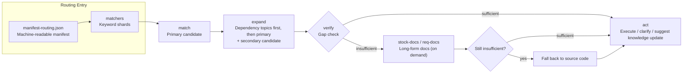
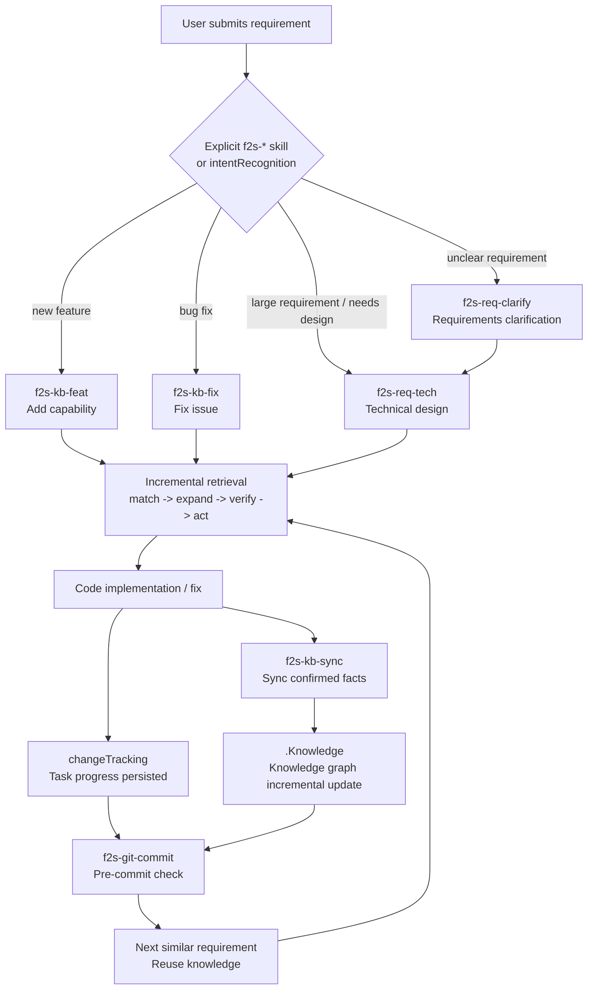
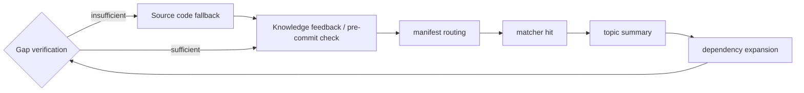

[中文](../Flow2Spec基础介绍.md) | [English](./Flow2Spec-Introduction.md) · [项目首页](../../README.zh-CN.md) | [Project home](../../README.md)

# Flow2Spec: Let Projects Naturally Grow a Knowledge Graph During Development

<p></p>

---

## I. Introduction

<p></p>

Over the past year, many AI coding tools have been solving the same problem: **helping Agents remember project context.**

That matters, of course. But talking about "project memory," "context management," and "rule files" alone is no longer enough.

Many open-source projects are already doing similar things: writing an `AGENTS.md` / `CLAUDE.md`, adding rules, creating a docs directory, having the Agent read project documentation first, or connecting a vector store for retrieval.

These approaches help, but what I really want to solve isn't "stuffing a bunch of context into the AI at startup." What I want to solve is:

**Can project knowledge be continuously accumulated, automatically routed, continuously validated, and evolve alongside the code — throughout the actual development process?**

That's Flow2Spec. One-line summary: **Flow2Spec is an Agent engineering framework that lets a project naturally grow a knowledge graph during development.**

---

## II. Why "Memory" Alone Isn't Enough

<p></p>

After many projects integrate AI, they quickly run into a paradox: you want the AI to understand the project better, but the more context you give it, the more likely it is to miss things, go off track, or forget what matters.

So people keep adding rules: read this file first, then that directory, don't touch this module, that interface has legacy compatibility, remember to update the docs after changes… Eventually the context becomes another burden. It looks like a knowledge base, but it's really more like an ever-expanding instruction manual.

Flow2Spec's position is: **project knowledge can't just be "written down" — it needs to be routable, composable, verifiable, and continuously updated.**

---

## III. Flow2Spec's Key Difference: A Knowledge Graph That Grows During Development

<p></p>

Flow2Spec doesn't ask you to do a massive documentation effort upfront. The recommended approach is:

1. Run `flow2spec init` to initialize an empty skeleton.
2. Use `f2s-doc-arch` to generate an architecture overview and bring it into the knowledge base.
3. When real requirements arrive, have the Agent route through existing knowledge first.
4. After implementation, use `f2s-kb-sync` to sync confirmed facts back into the knowledge base.
5. The next time a similar requirement comes up, draw from this knowledge incrementally.

**Knowledge isn't built all at once. It grows through requirements clarification, technical design, code implementation, bug fixing, knowledge sync, and committing code.**

This is what sets Flow2Spec apart from ordinary "project memory files": an ordinary solution hands the Agent a manual; Flow2Spec maintains an evolvable knowledge graph in the repository's `.Knowledge/` — diffable, reviewable, and committed alongside code.

---

## IV. The Knowledge Base Interface: Not a Pile of Docs, but a Routing Protocol

<p></p>

Flow2Spec's knowledge base has a clear interface structure:

```Plain Text
.Knowledge/
  manifest-routing.json   # Machine-readable routing manifest
  matchers/               # Keyword shards
  topics/                 # Topic summaries
  stock-docs/             # Long-form docs for shipped capabilities
  req-docs/               # Requirements and technical design docs

```

The Agent's reading order isn't free-form — it follows the protocol:

```Plain Text
manifest-routing.json
  -> matcher shard (single file pointed to by matcherPath)
  -> match (primary candidate)
  -> expand (dependency topics first, then primary topic; keep secondary candidate)
  -> verify (gap check)
      -> sufficient: act
      -> insufficient: stock-docs / req-docs (on demand)
          -> still insufficient: fall back to source code
          -> act or clarify
```

Figure 1: Incremental Knowledge Retrieval



The value of this structure: **the knowledge base doesn't expose "files" to the Agent — it exposes an interface for "how to find the right knowledge."**

`manifest-routing.json` tells the Agent what topics exist; `matchers/*.json` tells the Agent which topics a task might match; `topics/*.md` gives short summaries and hard constraints; `topicDependencies` tells the Agent which prerequisite rules must be read together; `stock-docs/` and `req-docs/` are only drilled into when needed.

---

## V. Incremental Retrieval: The Agent Only Takes What It Needs

<p></p>

Flow2Spec's retrieval model can be summarized in four steps: **match → expand → verify → act**

**match**: The Agent reads `manifest-routing.json`, then reads the corresponding matcher shard for the task. It doesn't traverse the entire knowledge base — it narrows down candidates first.

**expand**: After hitting the primary topic, the Agent continues reading dependency topics via `topicDependencies`, avoiding partial rule coverage. For example, a feature might depend on common config rules, auth rules, and a specific business module's constraints.

**verify**: Hitting a topic doesn't guarantee sufficient knowledge. Flow2Spec requires the Agent to check before acting: does the topic cover the user's question, are dependencies missing, is a long-form doc needed, should the user be asked first? This turns "looks like a match" into "confirmed ready to act."

**act**: Only when knowledge coverage is sufficient and boundaries are clear does the Agent proceed to implement, modify, or commit. If confidence is low, it clarifies first — it doesn't forge ahead.

---

## VI. Multi-Dependency Capability: Don't Let the Agent Read Only Half the Rules

<p></p>

In real projects, many errors happen because the Agent read only a local piece of knowledge and missed a prerequisite constraint:

- Changing a feature while reading the business topic, but missing commit rules
- Generating a technical design while reading requirements, but missing req-docs / stock-docs boundary rules
- Modifying config while reading the module description, but missing config switch defaults

Flow2Spec makes these dependencies explicit in the routing layer. A topic can declare which other topics it depends on; when the Agent hits a primary topic, it expands dependencies first. This isn't just "read a few more files" — it transforms project knowledge from flat documents into a graph with edges:

```Plain Text
Feature implementation
  -> Document routing rules
  -> Technical design rules
  -> Task tracking rules
  -> Git commit rules

```

This means every time the Agent reads, it gets a declared combination of context — not an isolated fragment.

---

## VII. Knowledge Base Correctness: Writing a Topic Isn't Enough

<p></p>

Two things kill a knowledge base: going stale, and being wrong. Flow2Spec doesn't assume the knowledge base is always correct — it builds verification into the development process.

A typical scenario: the user asks a business detail; the Agent checks the knowledge base, finds topic coverage but not enough detail, then drills into source code for a more accurate fact. At this point Flow2Spec shouldn't just answer and move on — it also needs to determine:

- Has this fact already been written into the topic?
- If not (or coverage isn't detailed enough), should it suggest `f2s-kb-distill` to extract this round's Q&A into the knowledge base?
- If knowledge appears covered, can it prove the coverage source? If not, it can't stay silent.

This is the "knowledge base feedback closing step." **It ensures new knowledge found in source code doesn't just live in this one chat session — it feeds back into the knowledge base.**

---

## VIII. User Intent Recognition: Not Every Message Should Trigger a Workflow

<p></p>

When the user says something, should the Agent answer, discuss, clarify, or jump straight into a development workflow?

- "Is this approach feasible?" → discussion, not automatic coding
- "Fix this bug" → enter the fix workflow
- "I want a new feature — help me clarify requirements first" → enter requirements clarification, not immediate implementation

Flow2Spec has an `intentRecognition` switch. When enabled, the Agent uses intent recognition rules: high-confidence new feature → feat workflow; high-confidence bug fix → fix workflow; unclear requirements → req-clarify; just asking or discussing → stay in normal conversation.

After being validated across real projects, **intent recognition is now stable enough that we recommend enabling it by default** and letting the Agent route automatically in most cases. You can still type `f2s-req-clarify`, `f2s-kb-feat`, `f2s-kb-fix`, etc. explicitly at any time to override the automatic decision.

---

## IX. A More Realistic Development Loop

<p></p>

With Flow2Spec, a requirement might flow like this:

```Plain Text
User submits requirement
  -> Explicit f2s-* skill / intentRecognition assists
  -> f2s-req-clarify until no ambiguity
  -> f2s-req-tech generates technical design
  -> Agent reads knowledge base incrementally
  -> Implements code
  -> changeTracking records task progress
  -> f2s-kb-sync syncs new knowledge
  -> f2s-git-commit pre-commit check

```

Figure 2: Knowledge Graph Growing Through Development



Every step leaves a trackable asset: requirements in `req-docs/`, shipped knowledge in `stock-docs/`, topic summaries in `topics/`, routing in `manifest-routing.json`, task progress in `.task/`.

**Flow2Spec isn't about making the AI answer better in a single session — it's about turning each development process into an incremental update to the project's knowledge graph.**

---

## X. It Manages More Than Knowledge — It Manages the Development Loop

<p></p>

**Task progress persistence**: When `changeTracking` is enabled, the Agent writes a task checklist to `.task/` during feature development or design implementation. New sessions resume from the on-disk task — no need to ask "where did we stop?"

**Technical designs don't follow a rigid template**: `f2s-req-tech` selects structure based on the current requirement, rather than mechanically filling every section — avoiding a frontend change generating a template full of database chapters.

**Multi-Agent orchestration and verification**: Complex tasks can be split to sub-Agents via `subAgent`. When `switchAgentVerification` is enabled, writer and verifier are separated, reducing the risk of an Agent writing, verifying, and approving its own work.

**Pre-commit knowledge coverage check**: `f2s-git-commit` checks diff, conflict markers, and staging scope before committing, and checks whether changes require a knowledge base sync — catching "changed code, forgot to update knowledge" before commit.

**Template and routing upgrade detection**: At startup, Flow2Spec checks whether `.Knowledge/` is behind the npm package version and prompts `f2s-kb-upgrade` to keep the project aligned with the latest structure and rules.

---

## XI. The Biggest Difference from Ordinary Knowledge Bases

<p></p>

In one sentence: **an ordinary knowledge base is something Agents query; Flow2Spec's knowledge base is something Agents help maintain.**

Figure 3: Ordinary Memory Files vs Flow2Spec Knowledge Graph




Ordinary knowledge bases focus on: where to put documents, how to retrieve them, how to summarize them.

Flow2Spec focuses more on: which topic to read when a requirement arrives, what dependencies exist between topics, whether current knowledge is sufficient to act, whether to feed knowledge back after a source code dive, whether user intent should trigger a workflow, whether knowledge updates alongside code changes, and whether knowledge coverage was checked before committing.

This is why Flow2Spec includes `.Knowledge/`, `.task/`, `f2s-*` skills, Agent rules, and `flow2spec.config.json` — they aren't separate pieces, but a protocol organized around the development loop.

---

## XII. Common Questions

<p></p>

**Q: After changing a capability, how do I make sure all related topics get updated?**

Flow2Spec doesn't promise "the model will automatically know all impact areas" — it turns impact discovery into an executable process.

A single capability change often affects more than one topic. For example, changing "batch rescoring" might affect:

| Type | What to check |
| --- | --- |
| Business capability topic | How this feature now works |
| Config topic | Whether switches, defaults, or thresholds changed |
| Rules topic | Whether idempotency, locking, error codes, or pre-commit checks changed |
| Module topic | Whether shared methods, directory boundaries, or call chains changed |

Flow2Spec raises coverage through five mechanisms:

1. Routing layer: matcher finds the primary topic
2. Dependency expansion: `topicDependencies` expands dependency topics
3. Sync confirmation: `f2s-kb-sync` outputs an update outline for user confirmation
4. Q&A closing: after a source code drill-down, prompts supplement if gaps are found
5. Commit gate: `f2s-git-commit` checks knowledge coverage before commit

**Example**: If you changed an "activity lottery count" feature, the update shouldn't just say "the lottery API changed" — it might also need:

- Activity business topic: how lottery counts are calculated
- Data model topic: which fields record claimed / remaining counts
- Rules topic: restrictions on browsing tasks, purchase tasks, duplicate claims
- Config topic: prize lists, switches, activity timing

> Flow2Spec's goal isn't to have the Agent intuitively edit one file — it's to first list which topics this change might affect, confirm, then write to disk.

---

**Q: How does Flow2Spec solve the problem of Agents forgetting rules?**

Two sides: **usage side** and **design side**.

**Usage side**: Rules aren't stuffed into one giant file — they're split into a routable, dependency-aware structure: entry rules in per-IDE config, business knowledge in `topics`, matching keywords in `matchers`, dependencies in `topicDependencies`, long-form docs in `stock-docs` / `req-docs`. The Agent doesn't act from memory — it re-fetches rules via `match → expand → verify → act` every time.

**Design side**: Five layers of constraints intercept "rules exist but aren't followed":

1. Entry layer: declare reading order and prohibitions
2. Config layer: read config switches before executing any skill
3. Routing layer: read manifest first for all tasks — no direct full-codebase search
4. Skill layer: each skill defines pre-checks, confirmation points, and closing steps
5. Gate layer: gates at multiple nodes — checklist before task archival, outline confirmation before knowledge writes, mandatory closing self-check after Q&A source dives, diff and knowledge coverage check before commit

Two typical scenarios show how these layers work: preventing intent misfire (user still clarifying — Agent must not jump to implementation); and preventing knowledge from not being fed back after a source code answer (must determine whether `f2s-kb-distill` is needed to extract this round's Q&A into the knowledge base — silent skipping not allowed).

Flow2Spec's goal isn't to completely eliminate forgetting — it's to make "bypassing rules" harder at every stage.

---

**Q: What if a single topic file gets too large?**

A topic's role is "routing summary": trigger keywords, boundaries, key constraints, and next-step pointers — not all details. Long content goes in `stock-docs/`; large features split into multiple focused topics connected by `topicDependencies`.

**Split example** (a feature with ten thousand lines of code):

```text
topics/
  activity-overview.md
  activity-task-rules.md
  activity-data-model.md
  activity-external-dependencies.md

stock-docs/
  activity-overview_final.md
  activity-task-rules_final.md
  activity-data-model_final.md
  activity-external-dependencies_final.md
```

The Agent reads "activity-overview" first to judge relevance; task state machine questions → "activity-task-rules"; table field questions → "activity-data-model".

This avoids topics too large to read thoroughly, or trigger keywords too broad that one topic matches everything.

---

**Q: What if the knowledge base doesn't cover the current module?**

Flow2Spec offers three complementary commands, distinguished by who triggers them and at what granularity:

`f2s-kb-distill` is **auto-suggested by the Agent**: after a single Q&A drills into source code, it extracts this round's Q&A into the KB; internally the skill decides whether to create a new topic or supplement an existing one based on drill-down depth and topic hits.

`f2s-kb-add <path or capability>` is **user-initiated**: use it when you want to parse an **entire module / legacy capability** into the KB in one go — accepts a path or multi-file aggregation, ideal for never-indexed blocks of code.

`f2s-kb-sync` is **user-initiated**: used for **global / batch sync** of shipped capabilities; supports zero-input inference and outputs an update outline before writing — ideal for periodic checkup-style reinforcement.

In short: **single Q&A → distill (auto), new module bulk import → add, periodic batch sync of shipped capabilities → sync**.

> Every time you "find an answer in source code," it can become a knowledge base improvement.

---

## XIII. What Projects Is This For + Quick Start

<p></p>

**Best for**: medium to large business projects, long-lived codebases, multi-person teams with many rules, teams using Cursor / Claude Code / Codex, and projects where you want AI to participate in maintaining project knowledge — not just read docs.

**May not fit**: one-off scripts or very small personal projects (\< 5000 lines, a README is enough).

**5-minute quick start**:

```Plain Text
npx @double-codeing/flow2spec@latest init

```

When getting started, we recommend typing `f2s-*` skills explicitly first to get familiar with them — it's the most efficient way to learn Flow2Spec. Enabling `intentRecognition` by default then lets the Agent route common tasks automatically.

Common workflows:

```Plain Text
/f2s-req-clarify   Requirements clarification
/f2s-req-tech      Generate technical design
/f2s-kb-feat       Add capability and sync knowledge
/f2s-kb-fix        Fix issue and correct knowledge
/f2s-kb-add <path> Parse an existing module into the knowledge base
/f2s-kb-distill    Extract this round's Q&A into the KB (auto-decides new topic vs. supplementing existing)
/f2s-kb-sync       Global / batch sync of shipped capabilities into the knowledge base
/f2s-git-commit    Pre-commit check and generate commit message

```

Currently supports initialization for Cursor, Claude Code, and Codex, with both Chinese and English templates.

---

## Closing

<p></p>

The end goal of AI coding isn't "writing more code." The truly hard part is: **letting AI continuously understand context in long-lived projects, and accumulating the new knowledge produced by each development cycle.**

Flow2Spec turns project knowledge from static documents into a routable, dependency-aware, verifiable, feedback-capable knowledge graph. It makes Agents not just consumers of context, but participants in maintaining it.

If your project already has these problems — explaining the same business rules every time, AI missing prerequisite constraints, docs and code drifting apart — give it a try:

```Plain Text
npx @double-codeing/flow2spec@latest init
```

Repository: `https://github.com/Lands-1203/Flow2Spec`

Live demo: `https://lands-1203.github.io/Flow2Spec/`

---

<p></p>

If Flow2Spec has been helpful, consider giving it a Star on GitHub — your support keeps the project going!

👉 **https://github\.com/Lands\-1203/Flow2Spec**

---
