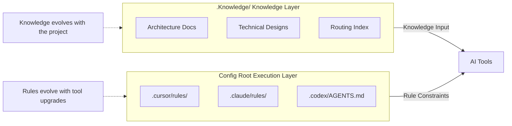
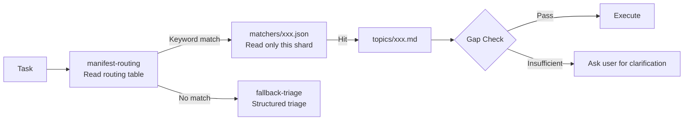
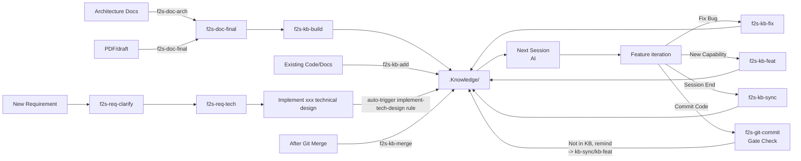
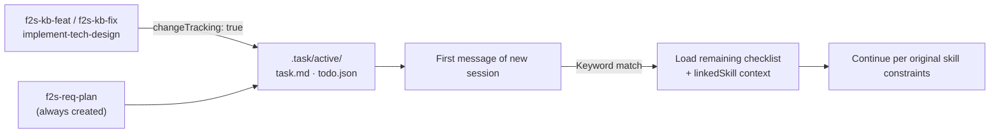
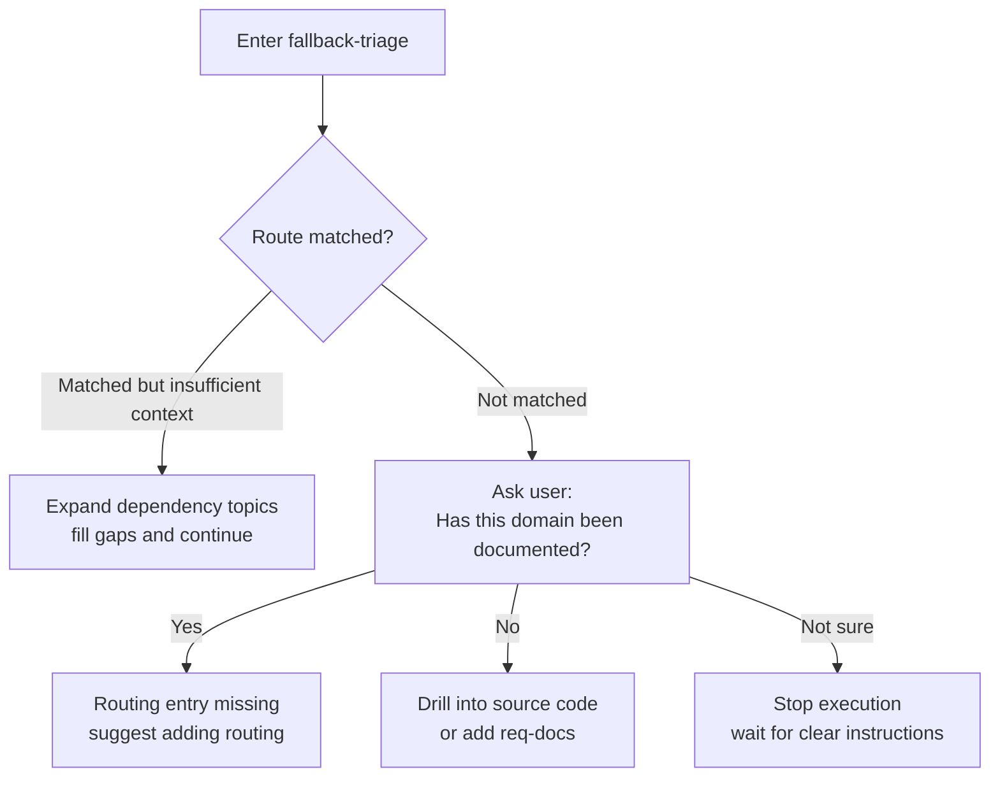
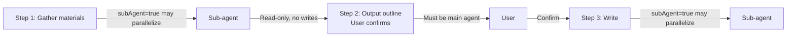
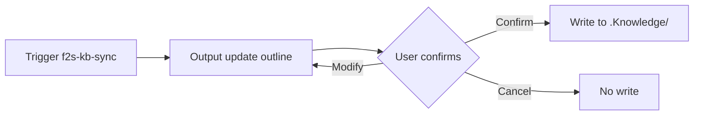

[中文](../设计说明.md) | [English](./design-principles.md)

# Flow2Spec Design Principles

## Problem Statement

```
❌ Current State                      ✅ After Flow2Spec

Architecture conventions  ──┐         .Knowledge/
Technical designs       ──┼──►  scattered     ├── manifest-routing.json
Module boundaries       ──┤    unstructured   ├── matchers/
Team experience         ──┘    reinterpreted  ├── topics/
                               every time      ├── stock-docs/
                                               └── req-docs/

                                               AI can read the project anytime
```

---

## Core Design

### 0. Memory Coding and Four Rings

**Memory Coding**: encode durable context into the **committed repository** (PR-reviewable), not private model memory or chat-only context.

Four rings in the repo (rules ring and skills ring are separate—do not merge):

| Ring | Location | Role |
| --- | --- | --- |
| Knowledge | `.Knowledge/` | Routing, topics, stock/req docs |
| Task | `.task/` | Cross-session continuation, user todos |
| Rules | Tool `rules` / `AGENTS.md` | How to read and act |
| Skills | `f2s-*` / `skills/` | Maintain KB, trigger workflows |

Flow2Spec delivers the **Memory Coding persistence and maintenance loop**, not "another RAG knowledge base."

### 0.1 Knowledge Ring: Multi-Layer Memory

Inside the knowledge ring: **horizontal narrowing** (L0 manifest → L1 matchers → L2 topics → L3 long docs) plus **vertical chaining** (`topicDependencies`: common → subdomain → whitelist → domain). The `match → expand → verify → act` pipeline operates on these layers; see [architecture.md §4](./architecture.md).

### 1. Separation of Knowledge and Rules




### 2. Progressive Routing




### 3. Skill Maintenance Loop

<p></p>

<details>
<summary>Mermaid source</summary>



</details>

Seven entry points  ·  `f2s-git-commit` is the knowledge discipline gate at commit time  ·  `.Knowledge/` is the single convergence point  ·  Knowledge drives AI, AI drives the next development cycle


### 4. Task Checklist and Cross-Session Continuation



Tasks do not get lost when a session ends  ·  Keywords enable automatic continuation without re-explaining context  ·  Skill constraints are fully restored

---

## Design Highlights

### A. Routing and Context Loading

#### 1. matchers sharded, not embedded in manifest

```
❌ Embedded in manifest              ✅ Independent shards

manifest.json (full read every time)   manifest-routing.json
├── task1: keywords:[...]    →          ├── task1 → m-order.json ──► read only this one
├── task2: keywords:[...]               ├── task2 → m-payment.json
└── task3: keywords:[...]               └── task3 → m-refund.json

                                        Updating keywords doesn't touch routing structure
                                        Per-routing token cost is fixed
```

#### 2. topicDependencies: dependencies on topics

```
❌ Attached at task level              ✅ Attached at topic level

taskA → [dep, main]               topicDependencies:
taskB → [main]      ← forgot        main: [dep]
taskC → [main]      ← forgot
                                    Any path loading main
Forgot when adding new task          automatically brings in prerequisite
→ silent failure                     dependencies
```

#### 3. topics store summaries, rules files store full text

```
.Knowledge/topics/implement-tech-design.md     ← lightweight, loaded during routing
┌──────────────────────────────────────────┐
│ Topic id, path conventions, next pointer │
│ ~100 lines                               │
└──────────────────────────────────────────┘
             ↓ read only after hit
.claude/rules/f2s-implement-tech-design.md     ← full text, loaded during execution
┌──────────────────────────────────────────┐
│ Complete execution constraints,           │
│ mandatory steps, prohibitions,           │
│ boundary descriptions                     │
│ ~500 lines                               │
└──────────────────────────────────────────┘
```

Routing layer stays lightweight  ·  Execution details load on demand  ·  The two evolve independently

#### 4. Full-scan prohibition is a hard constraint

```
Read order (mandatory)

  1. manifest-routing.json   ← read the routing table first
  2. matchers/xxx.json       ← read only the matched shard
  3. index.md                ← on demand, confirm semantics
  4. stock-docs / req-docs   ← on demand, supplement context
  5. Business source code    ← last resort

  ❌ Before reading manifest, full-repo unbounded scan is prohibited
  ❌ Within the same task line, manifest already read, do not re-read in full
  ❌ index.md must not be alternated with manifest as a "checklist" to replace decisions
```

#### 5. Skill trigger words in the description field

```yaml
name: f2s-kb-sync
description: >
  Sync implemented capabilities to the knowledge base.
  Triggers: f2s-kb-sync, full sync, knowledge base sync, implemented capabilities
```

```
User input → Agent scans description for semantic match → triggers corresponding skill
```

Trigger words are in the `description` field  ·  not in the skill body  ·  higher hit rate  ·  bilingual coverage reduces missed triggers

---

### B. Knowledge Structure

#### 1. stock-docs vs req-docs semantic prohibition

```
stock-docs/                        req-docs/
Architecture docs / Final draft    Requirements / Technical designs

     ↓ used for                           ↓ used for
Knowledge routing / Background      Drive coding implementation
reference

     ✅ May be read                      ✅ May be read
     ❌ Cannot be used as coding input    ✅ Input for implement-tech-design
```

Prevents: driving implementation with outdated reference docs → code diverging from the latest design

#### 2. init is idempotent

```
flow2spec init   can be safely re-run

        ✅  Does                         ❌  Does NOT
┌─────────────────────┐      ┌─────────────────────┐
│ Fill missing         │      │ Write business       │
│ directories/templates│      │ document content     │
│ Install rules/skills │      │ Update routing       │
│                       │      │ keywords             │
│ Align package-level   │      │ Overwrite existing   │
│ structure             │      │ knowledge content    │
└─────────────────────┘      └─────────────────────┘

Structural operations  ≠  Business semantics    The two have no overlapping responsibilities
```

#### 3. Knowledge versioning

```
git log .Knowledge/

  a3f1c2  f2s-kb-feat: add refund state machine routing
  b7e9d1  f2s-kb-fix: fix RestTemplate injection conventions
  c2a8f0  f2s-kb-build: onboard order service architecture docs
  d5b3e9  f2s-kb-sync: consolidate payment retry queue design

  Code changes  +  Knowledge changes  →  same commit or adjacent commits
```

Knowledge has versions  ·  is reviewable  ·  is traceable  ·  is blameable

#### 4. No accumulation of historical negation

```
❌ Wrong approach (knowledge base grows bloated)        ✅ Correct approach (only current truth)

  RestTemplate convention (updated 2026-05)              RestTemplate must be injected via Bean
  ~~Previously incorrectly used new RestTemplate()~~     Direct new RestTemplate() is prohibited
  → No longer related to direct instantiation
  → Old approach deprecated, now uses Bean injection
```

Rewrite in place with each fix  ·  don't layer history  ·  the knowledge base always describes only the present

---

### C. Execution Constraints

#### 1. Mandatory steps are constraints, not suggestions

```
implement-tech-design execution flow

  Input normalization
      ↓
  Read proposal and context
      ↓
  ★ Output implementation task list    ← cannot skip
      ↓
  ★ Confirm before implementing       ← cannot skip
      ↓
  Implement per task list
      ↓
  Output pending checklist and reminders  ← cannot skip
```

Suggestions → can be skipped  ·  Constraints → must be explicitly addressed before proceeding

#### 2. fallback is itself a procedurally-defined topic




No match ≠ silent failure  ·  degradation itself has a clear procedure

#### 3. manifest / index write authority hard constraint

```
Sub-agents MAY write              Sub-agents MUST NOT touch
────────────────────             ────────────────────
Code implementation files        manifest-routing.json  ← always written by main agent
stock-docs content files         .Knowledge/index.md    ← always written by main agent
topics content files (diff mode)
matchers/*.json (diff mode)
```

When multiple sub-agents run in parallel, shared state files are written single-point by the main agent to prevent concurrent conflicts

#### 4. Document changes vs code changes: different splitting strategies

```
Code sub-packages                  Document sub-packages
────────────────────             ────────────────────
✅ Can delegate to sub-agents     ❌ Not split by default, main agent writes directly
✅ Sub-agents write directly      If outsourcing is necessary →
                                  Sub-side only outputs before/after diff snippets
                                  Main agent reviews and merges
                                  ❌ Full-file rewrite is strictly prohibited
```

Rationale: documents need to guarantee "current truth coverage / consistent style / no accumulation of historical negation"  ·  requires the writer to see the full context

#### 5. Task checklist and cross-session continuation

```
Keyword-based automatic continuation example

  First sentence of a new session: "There's still an issue with payment callback"
      ↓
  Matches each entry's keywords in todo.json
      ↓
  Hit { name: "payment_callback_fix", keywords: ["payment", "callback"] }
      ↓
  Load task.md (show remaining steps)
  linkedSkill = "f2s-kb-fix" → load SKILL.md
      ↓
  Skill's write rules / style requirements / self-check checklist are fully restored
  User doesn't need to re-describe context, can continue directly

  ✅ No need to say "continue the previous task"
  ✅ Skill constraints are fully restored, consistent with the first invocation
```

```
todo.json write authority constraint

  Main agent ── read / write todo.json   ✅
  Sub-agent  ── read todo.json           ✅
  Sub-agent  ── write todo.json          ❌

  Rationale: when multiple sub-agents write concurrently,
  concurrent writes cause entries to overwrite each other
```

Lifecycle is driven by skills  ·  keyword routing enables cross-session automatic continuation  ·  linkedSkill ensures full restoration of skill constraints

---

### D. Agent Orchestration

#### 1. subAgent × switchAgentVerification are orthogonal

```
                    switchAgentVerification
                   false            true
     subAgent  ┌────────────┬─────────────────┐
     true →    │ Parallel    │ Parallel         │
               │ execution   │ execution         │
               │ Writer-side │ Sub writes→Main   │
               │ self-verify │ verifies          │
               │             │ Main writes→Sub   │
               │             │ verifies          │
               ├────────────┼─────────────────┤
     false →   │ Sequential │ Sequential         │
               │ execution  │ execution          │
               │ Main agent │ Main agent         │
               │ self-      │ self-verifies      │
               │ verifies   │ (no sub-side       │
               │            │  for cross-check)   │
               └────────────┴─────────────────┘
```

Two orthogonal dimensions  ·  independently configurable  ·  default is bottom-left

#### 2. Confirmation authority cannot be delegated to sub-agents




User dialogue only flows through the main agent  ·  confirmation decisions cannot bypass the user  ·  sub-agents only execute, never decide

#### 3. Skills can override global subAgent configuration

```
flow2spec.config.json        f2s-req-clarify SKILL.md
subAgent: true               This skill does not split by default:
                             regardless of subAgent value,
                             the clarification process stays
                             entirely in the main session

Rationale: requirement clarification depends heavily on continuous same-session follow-up
           splitting would break context, degrading clarification quality
```

Global configuration is the upper bound for allowing splits  ·  each skill decides for itself whether splitting is appropriate  ·  config being true does not guarantee splitting

#### 4. f2s-kb-sync: outline first, write after confirmation




Writing is a destructive operation  ·  the outline is the user's only chance to correct  ·  nothing is written before confirmation

#### 5. Zero-input inference

```
f2s-kb-sync three input modes

  Mode 1: User explicitly provides capability list   "Sync the refund state machine into the knowledge base"
  Mode 2: User provides supplementary materials      @src/refund/ @docs/proposal.md
  Mode 3: Zero input                                "f2s-kb-sync" (just this one sentence)
                                       ↓
                                  Agent infers based on session context
                                  what was implemented and what is worth consolidating
```

Session context itself is an information source  ·  no need for users to organize and re-input

#### 5.1 How execution switches reach the Agent (multi-platform prompts)

`flow2spec.config.json` determines **`subAgent` / `switchAgentVerification` / `changeTracking`**, but AI products **do not guarantee** that the file is automatically opened at session start. The design uses **multiple weak constraint layers** to reduce the probability of "running `f2s-*` without reading the config", while avoiding maintaining a verbose duplicate of `.codex/topics/f2s-config-check.md` in `.Knowledge`:

| Mechanism | Design Intent |
| --- | --- |
| **Cursor `f2s-config-check.mdc`** | Rule-layer enforcement: "Read before skill body"; Cursor hooks are used for update checks only, not automatic config reads. |
| **Claude `f2s-config-session` SessionStart** | Injects one config summary when the conversation starts, reducing the chance that the setting is forgotten. |
| **Claude `f2s-config-inject` PreToolUse** | Only guards **`f2s-*` Skill** calls by reminding the agent that the first skill-body action must be Read; it no longer repeatedly injects the full config. |
| **Codex `AGENTS.md` / `.codex/topics/f2s-config-check.md`** | Text-layer enforcement: "Read before skill body"; Codex hooks are used for update checks only, not automatic config reads. |
| **Codex `AGENTS.md` + `renderProjectConfigBlock`** | Top-level **Read** hard constraint + **init snapshot table** (if inconsistent with disk, Read takes precedence). |
| **Knowledge base `config-precheck` topic** | When routing hits, provides only **summary** and a pointer to the Codex full text, **not** a substitute for Read JSON. |

**Authority remains** the **Read** result of the project-root JSON; each layer is a prompt, not a second source of truth. For the complete operational table and paths, see **[Usage Guide § 1. `f2s-*` and `flow2spec.config.json`](./usage-guide.md)**.

#### 6. Skills don't restate unified entry rules, only reference them

```
Each SKILL.md's orchestration section reads:

  subAgent / switchAgentVerification semantics
  are defined in the unified entry as the sole source of truth,
  not restated here.
  ↓
  Cursor/Claude → rules/f2s-flow2spec-unified-entry.*
  Codex         → .codex/topics/f2s-flow2spec-unified-entry.md

  15 skills, each only writes its own unique orchestration constraints
  Common rules are defined in one place; modifying one location affects all
```

---

### E. Pluggable Architecture

#### 1. Tools are pluggable: one knowledge base, any tool combination

```
flow2spec init cursor claude codex   ← all three tools installed
flow2spec init claude                ← only Claude
flow2spec init cursor codex          ← skip Claude

.Knowledge/ stays the same, tools can be added or removed at any time
```

The same `.Knowledge/` drives all tools  ·  adding/removing tools does not affect knowledge content  ·  new tools integrate with zero rebuild

#### 2. Knowledge topics are pluggable: add/remove without side effects

```
Adding a topic                         Removing a topic
─────────────────────               ─────────────────────
1. Write topics/xxx.md               f2s-kb-rm stock-docs/xxx.md
2. Write matchers/m-xxx.json                  ↓
3. Register in manifest-routing       Automatically cleans up topics/ + manifest
                                       + index references

Other topics remain completely unaffected
```

New topics simply declare dependencies in `topicDependencies`  ·  if they don't, they're independent  ·  removal has no side effects

#### 3. Skills are pluggable: self-contained units, project-level overrides package-level

```
Package-level skills (shipped with flow2spec init)     Project-level skills (placed in config root/skills/)

f2s-kb-sync/SKILL.md                  my-domain-skill/SKILL.md
f2s-doc-arch/SKILL.md                 my-review-skill/SKILL.md
...

If names don't conflict they coexist  ·  same name → project-level overrides package-level  ·  they're unaware of each other
```

Skills describe their own trigger words via the `description` field  ·  no registry needed  ·  no global config changes needed  ·  effective upon deployment

#### 4. Routing vocabulary is pluggable: shard isolation, local updates

Vocabulary changes only modify the corresponding `matchers/m-xxx.json`, with zero diff for other routes; see structure in "[A. Routing and Context Loading → matchers sharding](#1-matchers-sharded-not-embedded-in-manifest)".

Vocabulary changes are localized  ·  merge conflicts are minimized  ·  new routes don't affect existing ones

#### 5. Execution model is pluggable: config switches per project

```
flow2spec.config.json

  subAgent: false               → main agent throughout, low overhead, suitable for small projects
  subAgent: true                → allow sub-agent parallelization, suitable for large-scale changes

  switchAgentVerification: false → writer-side self-verify, daily use
  switchAgentVerification: true  → cross-verification, high-confidence critical scenarios

  changeTracking.feat: true        → f2s-kb-feat creates a task checklist by default
  changeTracking.fix: false        → f2s-kb-fix does not create a task checklist by default
  changeTracking.implement: true   → implement-tech-design creates a task checklist by default

  Three orthogonal dimensions · each skill can further refine and override global config
```

Change one line of config to switch execution strategy  ·  no skill files need modification  ·  new projects work out of the box, existing projects upgrade on demand

---

## Strengths and Limitations

```
✅ Strengths                         ⚠️  Limitations

Precise context                      Upfront investment: knowledge must be built via skills
└─ Routing loads only relevant docs  Scale threshold: overhead > benefit for small projects

Cross-tool sharing                   Requires team discipline
└─ Write knowledge once, use in all  └─ Skills reduce friction, don't eliminate it

Tool-agnostic                        Learning curve
└─ Switch tools without rebuilding   └─ stock/req boundary, routing structure aren't intuitive

Sustainable
└─ Maintenance tied to development actions
```

---

## Who Is It For

```
                       Project Scale
                 Small ◄──────────► Large
         ┌──────────┬────────────┐
    Short │  Not     │  Can use   │
    Term  │  needed  │            │
         ├──────────┼────────────┤
    Long  │  Can use │ Highly     │
    Term  │          │ recommended│
         └──────────┴────────────┘

Best suited when: has scale · long-term iteration · multi-tool or multi-person AI collaboration
```

---

## Related Documents

- [Usage Guide](./usage-guide.md)
- [Commands Reference](./commands-reference.md)
- [Architecture](./architecture.md)
- [Usage Scenarios](./usage-scenarios.md)
