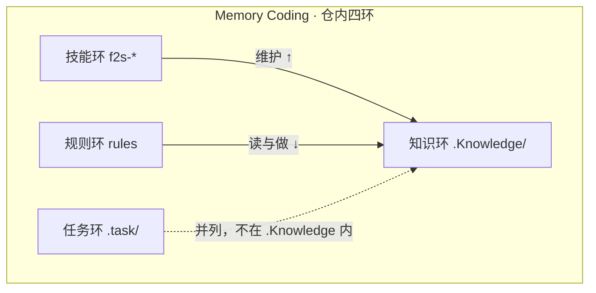
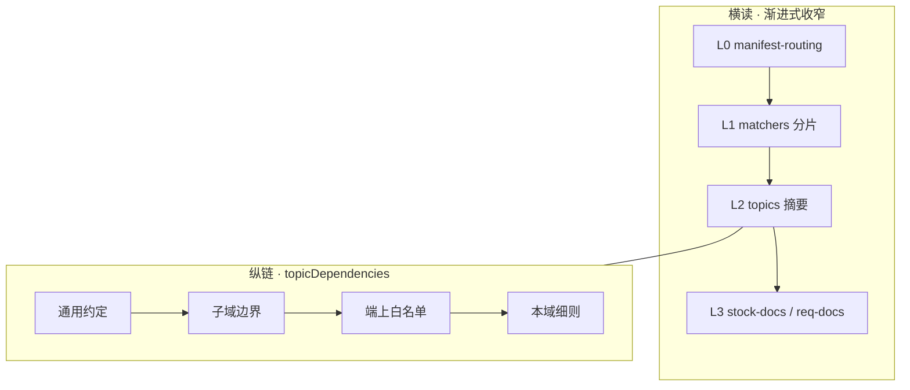
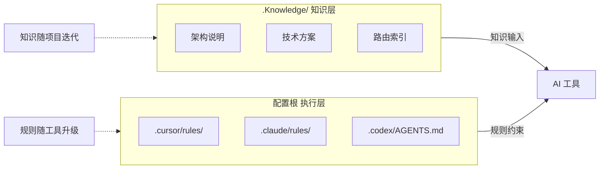
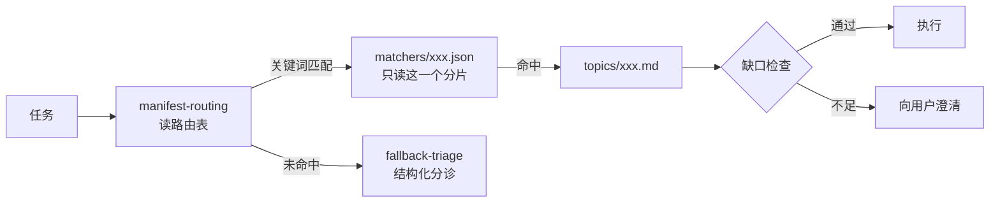
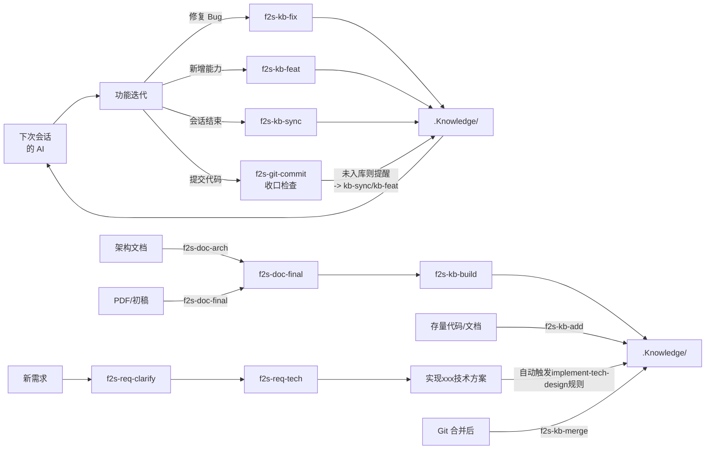
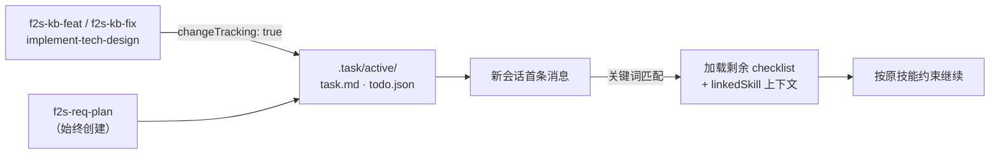
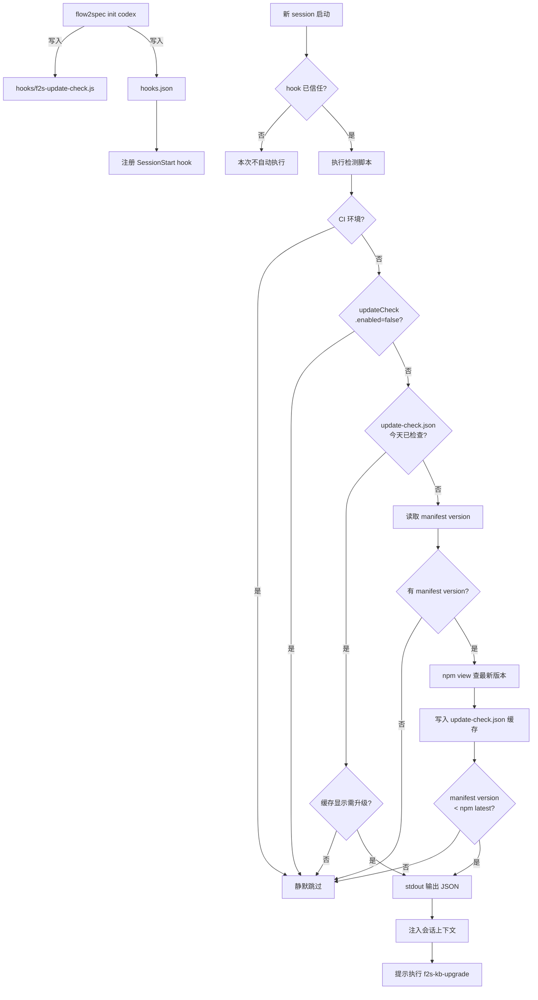
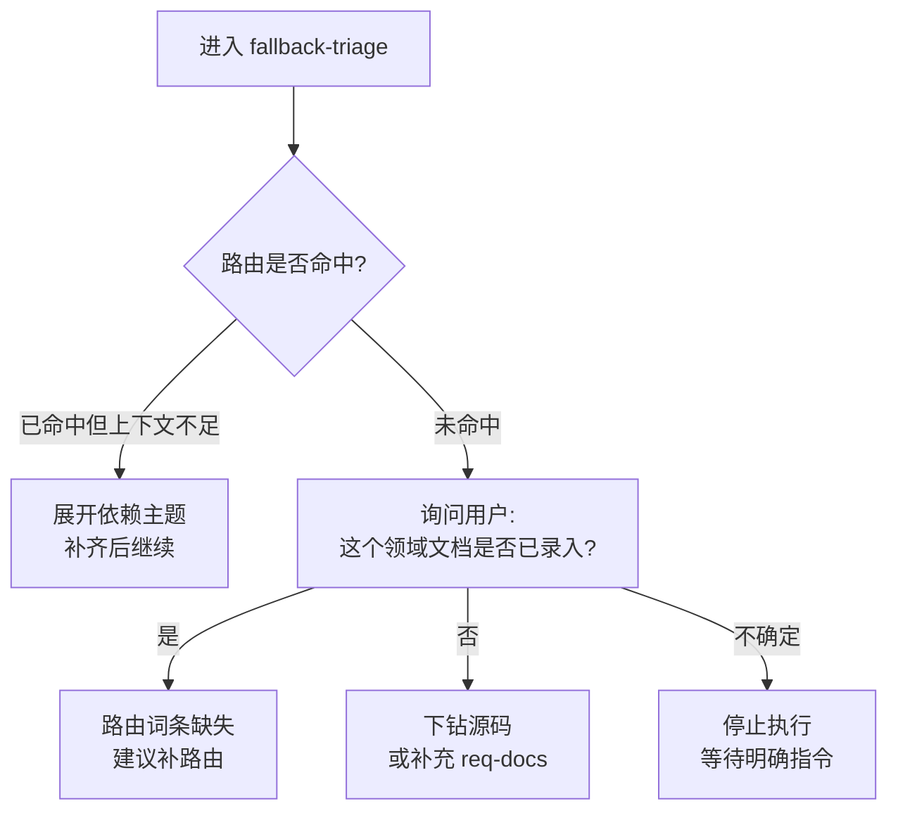
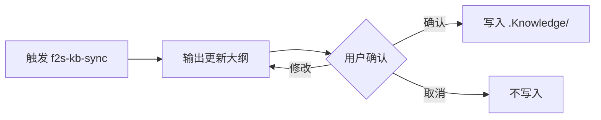

# 设计说明

[English](./en/design-principles.md)

## 解决的问题

```
❌ 现状                          ✅ Flow2Spec 之后

架构约定  ──┐                    .Knowledge/
技术方案  ──┼──► 散落            ├── manifest-routing.json
模块边界  ──┤    无结构           ├── matchers/
团队经验  ──┘    每次重新解释     ├── topics/
                                 ├── stock-docs/
                                 └── req-docs/

                                 AI 随时能读懂项目
```

---

## 核心设计

### 0. Memory Coding 与仓内四环

**Memory Coding**：把必须长期记住的上下文**编码进可提交仓库**（可 PR、可 review），而不是押在模型 Memory 或聊天里。

仓内 **四环**（规则环与技能环分列，勿合并为「规则+技能」）：


| 环   | 落点                        | 职责                      |
| --- | ------------------------- | ----------------------- |
| 知识环 | `.Knowledge/`             | 路由 + 主题 + 存量/需求文档       |
| 任务环 | `.task/`                  | 跨会话续作、用户代办              |
| 规则环 | 各工具 `rules` / `AGENTS.md` | 怎么读、怎么做（缺口闸门、路由顺序）      |
| 技能环 | `f2s-`* / `skills/`       | 维护知识、触发 feat/fix/sync 等 |





Flow2Spec 提供的是 **Memory Coding 的落盘与维护闭环**，不是「又一个 RAG 知识库」。

### 0.1 知识环：多层记忆结构

知识环内部是 **横读 + 纵链** 的多层结构（与下文「渐进式路由」「topicDependencies」对应）：




| 层级  | 路径                        | 作用                   |
| --- | ------------------------- | -------------------- |
| L0  | `manifest-routing.json`   | 机读路由、依赖声明            |
| L1  | `matchers/*.json`         | 关键词命中，**match** 只读一片 |
| L2  | `topics/*.md`             | 硬约束摘要；**expand** 拉依赖 |
| L3  | `stock-docs/`、`req-docs/` | 长文档，按需下钻             |
| 纵链  | `topicDependencies`       | 主题级前置，所有任务共享         |


读取流水线：`match → expand → verify → act`（详见 [体系与原理 §4](./体系与原理.md)）。

### 1. 知识与规则分离




### 1.1 规则范围与优先级

Flow2Spec 的 rules 存在少量**有意重叠**：全局入口负责总路线，专项规则负责某个环节的强约束。这样做是为了降低 Agent 漏读关键步骤的概率，但执行时必须按优先级理解，避免把相似描述当成冲突。


| 场景                                | 优先规则                          | 说明                                                                                                   |
| --------------------------------- | ----------------------------- | ---------------------------------------------------------------------------------------------------- |
| 普通提问首读 / 首工具调用                    | `f2s-knowledge-preflight`     | 决定当前仓库相关问题是否必须先读 `.Knowledge/manifest-routing.json`，并约束缺口闸门与源码下钻节奏。                                  |
| 普通问答源码补答收口                        | `f2s-kb-feedback-closing`     | 源码补答后强制四 case 显式表态：case 1～3 输出 `f2s-kb-add` / `f2s-kb-sync` 补充建议，case 4 输出"知识库已覆盖"显式标记；禁止悄悄跳过整个收口流程。 |
| 全局路由事实源 / 渐进式读取链路                 | `f2s-flow2spec-unified-entry` | 定义 manifest、matcher、topic、stock-docs/req-docs 的读取顺序与事实源口径。                                           |
| 执行任意 `f2s-`* 技能前读配置               | `f2s-config-check`            | 专门约束技能首步必须读 `flow2spec.config.json`。                                                                 |
| 按技术方案实现                           | `f2s-implement-tech-design`   | 命中技术方案实现时的完整执行条令。                                                                                    |
| `stock-docs` / `req-docs` 边界      | `f2s-stock-docs-vs-req-docs`  | 详细约束存量上下文与需求/技术方案文档的路径职责。                                                                            |
| 写 topic / metadata / dependencies | `f2s-topic-authoring`         | 创作侧规则，约束主题命名、粒度、分类、依赖与落盘。                                                                            |
| 任务清单维护                            | `f2s-task`                    | 约束 `.task/` 的创建、续作、归档。                                                                               |
| 通用编码习惯                            | `f2s-karpathy-guidelines`     | 只作为编码纪律补充；不得覆盖 f2s 强制流程。                                                                             |


核心原则：**门禁规则先判断是否必须读 / 是否允许做，专项规则再决定具体怎么做**。若规则表述重叠，按上表的场景优先级执行。

### 2. 渐进式路由




### 3. 技能维护闭环


Mermaid 源码




七条入口 · `f2s-git-commit` 是提交时的知识纪律收口 · `.Knowledge/` 是唯一汇聚点 · 知识驱动 AI，AI 驱动下轮开发

### 4. 任务清单与跨会话续作




任务不因会话结束丢失 · 关键词自动续作，无需重新说明上下文 · 技能约束完整恢复

---

## 设计亮点

### 一、路由与上下文加载

#### 1. matchers 分片，不嵌入 manifest

```
❌ 嵌入 manifest                  ✅ 独立分片

manifest.json (每次全读)          manifest-routing.json
├── task1: keywords:[...]    →    ├── task1 → m-order.json ──► 只读这一个
├── task2: keywords:[...]         ├── task2 → m-payment.json
└── task3: keywords:[...]         └── task3 → m-refund.json

                                  更新关键词不动路由结构
                                  每次路由 token 成本固定
```

#### 2. topicDependencies：依赖挂在主题上

```
❌ 挂在任务级                     ✅ 挂在主题级

taskA → [dep, main]               topicDependencies:
taskB → [main]      ← 漏写了        main: [dep]
taskC → [main]      ← 漏写了
                                  任何路径加载 main
新增任务时漏写 → 静默失效          都自动带上前置依赖
```

#### 3. topic 只存摘要，规则文件存全文

```
.Knowledge/topics/implement-tech-design.md     ← 轻量，路由时加载
┌──────────────────────────────────────────┐
│ 主题 id、路径约定、下一步指针             │
│ ~100 行                                   │
└──────────────────────────────────────────┘
             ↓ 命中后才读
.claude/rules/f2s-implement-tech-design.md     ← 全文，执行时加载
┌──────────────────────────────────────────┐
│ 完整执行约束、强制步骤、禁止项、边界说明  │
│ ~500 行                                   │
└──────────────────────────────────────────┘
```

路由层保持轻量 · 执行细节按需加载 · 两者独立更新

#### 4. 禁止全量扫描是硬约束

```
读取顺序（必须）

  1. manifest-routing.json   ← 先看路由表
  2. matchers/xxx.json       ← 只读命中分片
  3. index.md                ← 按需，确认语义
  4. stock-docs / req-docs   ← 按需，补充背景
  5. 业务源码                ← 最后手段

  ❌ 未读 manifest 前，禁止全仓无范围扫描
  ❌ 同一任务线内，manifest 已读则不重复全文读取
  ❌ index.md 禁止与 manifest 交替"刷清单"代替决策
```

#### 5. 技能触发词写在 description 字段

```yaml
name: f2s-kb-sync
description: >
  同步已实现能力到知识库。
  触发词：f2s-kb-sync、全局同步、知识库同步、已实现能力
```

```
用户输入 → Agent 扫 description 做语义匹配 → 触发对应技能
```

触发词在 description 里 · 不在正文里 · 命中率更高 · 双语覆盖减少漏触发

---

### 二、知识结构

#### 1. stock-docs vs req-docs 语义禁止

```
stock-docs/                        req-docs/
架构说明 / 终稿                     需求 / 技术方案

     ↓ 用于                              ↓ 用于
知识路由 / 背景参考              驱动编码实现

     ✅ 可以读                           ✅ 可以读
     ❌ 不能作为编码输入                  ✅ implement-tech-design 的输入
```

防止：用过期参考文档驱动实现 → 代码与最新方案脱节

#### 2. init 幂等

```
flow2spec init  可以安全重跑

        ✅  做                         ❌  不做
┌─────────────────────┐      ┌─────────────────────┐
│ 补齐缺失目录和模板   │      │ 写业务文档内容       │
│ 落盘 rules/skills   │      │ 更新路由关键词       │
│ 包级结构对齐        │      │ 覆盖已有知识内容     │
└─────────────────────┘      └─────────────────────┘

结构操作  ≠  业务语义         两者职责不交叉
```

#### 3. 知识版本化

```
git log .Knowledge/

  a3f1c2  f2s-kb-feat: 新增退款状态机路由
  b7e9d1  f2s-kb-fix: 修正 RestTemplate 注入约定
  c2a8f0  f2s-kb-build: 订单服务架构说明入库
  d5b3e9  f2s-kb-sync: 沉淀支付重试队列设计

  代码变更  +  知识变更  →  同一 commit 或相邻 commit
```

知识有版本 · 可 review · 可回溯 · 可 blame

#### 3.1 版本检测与升级提示



以 Codex 为例；Claude / Cursor 链路相同，仅 hook 配置路径不同。每日首次启动触发版本比对，需要升级时通过 `additionalContext` 注入提示，无需人工检查。

#### 4. 禁止历史否定堆砌

```
❌ 错误写法（知识库越来越臃肿）        ✅ 正确写法（只保留当前成立的表述）

  RestTemplate 约定（更新于 2026-05）    RestTemplate 必须通过 Bean 注入
  ~~原错误地使用 new RestTemplate()~~    禁止直接 new RestTemplate()
  → 不再与直接实例化有关
  → 原写法已废弃，现改为 Bean 注入
```

每次修复原位改写 · 不叠加历史 · 知识库永远只描述现在

---

### 三、执行约束

#### 1. 强制步骤是约束，不是建议

```
implement-tech-design 执行流

  输入标准化
       ↓
  读取方案与上下文
       ↓
  ★ 输出实现任务列表    ← 不可跳过
       ↓
  ★ 实现前提问确认      ← 不可跳过
       ↓
  按任务列表实现
       ↓
  输出待完成清单与提醒   ← 不可跳过
```

建议 → 可以被跳过 · 约束 → 必须明确处理才能继续

#### 2. fallback 本身是有程序的 topic




未命中 ≠ 静默失败 · 降级本身有明确程序

#### 3. manifest / index 写权硬约束

```
子 agent 可以落盘的               子 agent 不得触碰
────────────────────             ────────────────────
代码实现文件                      manifest-routing.json  ← 恒主 agent 落盘
stock-docs 内容文件               .Knowledge/index.md    ← 恒主 agent 落盘
topics 内容文件（diff 模式）
matchers/*.json（diff 模式）
```

多个子 agent 并行时，共享状态文件由主 agent 单点写入，防止并发冲突

#### 4. 文档改动 vs 代码改动，拆分策略不同

```
代码子包                          文档子包
────────────────────             ────────────────────
✅ 可下放子 agent 执行            ❌ 默认不拆，主 agent 直接写
✅ 子 agent 直接落盘              若确需外包 →
                                  子侧只输出 before/after diff 片段
                                  主 agent 审核后合并落盘
                                  ❌ 整文件重写严格禁止
```

原因：文档需要保证「现行真值覆盖 / 文风一致 / 禁历史否定堆砌」 · 要求写的人看到全文上下文

#### 5. 任务清单与跨会话续作

```
关键词自动续作示例

  新会话第一句："支付回调还有个问题"
       ↓
  匹配 todo.json 各条目 keywords
       ↓
  命中 { name: "payment_callback_fix", keywords: ["支付", "回调"] }
       ↓
  加载 task.md（展示剩余步骤）
  linkedSkill = "f2s-kb-fix" → 加载 SKILL.md
       ↓
  技能的落盘规则 / 文风要求 / 自检清单全部恢复
  用户无需重新描述上下文，直接继续

  ✅ 不需要说"继续上次任务"
  ✅ 技能约束完整恢复，与首次调用一致
```

```
todo.json 写权约束

  主 agent ── 读 / 写 todo.json   ✅
  子 agent ── 读 todo.json        ✅
  子 agent ── 写 todo.json        ❌

  原因：多子 agent 并行落盘时，并发写会导致条目互相覆盖
```

生命周期由技能驱动 · 关键词路由实现跨会话自动续作 · linkedSkill 保证技能约束完整恢复

---

### 四、Agent 编排

#### 1. subAgent × switchAgentVerification 正交

```
                    switchAgentVerification
                   false            true
     subAgent  ┌────────────┬─────────────────┐
     true →    │ 并行执行    │ 并行执行         │
               │ 落盘侧自验  │ 子落盘→主验      │
               │            │ 主落盘→子验      │
               ├────────────┼─────────────────┤
     false →   │ 顺序执行   │ 顺序执行         │
               │ 主 agent   │ 主 agent 自验    │
               │ 自验       │（无子侧可交叉）   │
               └────────────┴─────────────────┘
```

两个维度正交 · 独立配置 · 默认左下角

#### 2. 确认权不可下放子 agent


用户对话只经过主 agent · 确认决策不可绕过用户 · 子 agent 只做执行不做决策

#### 3. 技能可覆盖全局 subAgent 配置

```
flow2spec.config.json        f2s-req-clarify SKILL.md
subAgent: true               本技能默认不拆子：
                             无论 subAgent 真值，
                             澄清流程全程在主会话

原因：需求澄清强依赖连续同会话追问
     拆子会断上下文，导致澄清质量下降
```

全局配置是允许拆的上限 · 技能自己判断是否适合拆 · 配置 true 不等于一定拆

#### 4. f2s-kb-sync 先出大纲，确认后再写




写入是破坏性操作 · 大纲是用户唯一的纠错机会 · 确认前不落盘

#### 5. 零输入推断

```
f2s-kb-sync 三种输入方式

  方式 1：用户显式给出能力列表    "帮我把退款状态机同步进知识库"
  方式 2：用户给辅助材料          @src/refund/ @docs/方案.md
  方式 3：零输入                  "f2s-kb-sync"（仅此一句）
                                       ↓
                                  Agent 基于会话上下文推断
                                  本次实现了什么、有什么值得沉淀
```

会话上下文本身就是信息源 · 不需要用户整理再输入

#### 5.1 执行开关如何进入 Agent（多端提示）

`flow2spec.config.json` 决定 `**subAgent` / `switchAgentVerification` / `changeTracking**`，但各 AI 产品**不保证**会话启动即自动打开该文件。设计上用 **多条弱约束叠加** 降低「未读配置就开跑 `f2s-*`」的概率，同时避免在 `.Knowledge` 再维护一份与 `.codex/topics/f2s-config-check.md` 逐字重复的长文：


| 机制                                                          | 设计意图                                                 |
| ----------------------------------------------------------- | ---------------------------------------------------- |
| **Cursor `f2s-config-check.mdc`**                           | 规则层强制「技能正文前先 Read」；Cursor hook 仅用于版本更新检测，不自动读取配置。    |
| **Claude `f2s-config-session` SessionStart**                | 会话开始时注入一次配置摘要，降低遗忘概率。                                |
| **Claude `f2s-config-inject` PreToolUse**                   | 仅在调用 `**f2s-*` Skill** 时做守门提示，提醒首步必须 Read；不反复注入完整配置。 |
| **Codex `AGENTS.md` / `.codex/topics/f2s-config-check.md`** | 文本层强制「技能正文前先 Read」；Codex hook 仅用于版本更新检测，不自动读取配置。     |
| **Codex `AGENTS.md` + `renderProjectConfigBlock`**          | 顶部 **Read** 硬约束 + **init 快照表**（与磁盘不一致时以 Read 为准）。    |
| **知识库 `config-precheck` 主题**                                | 路由命中时只提供**摘要**与链向 Codex 长文，**不**替代 Read JSON。        |


**权威仍为**项目根 JSON 的 **Read** 结果；各层为提示而非第二份真值源。操作侧完整表格与路径见 **[使用说明 § 一、`f2s-*` 与 `flow2spec.config.json](./使用说明.md)`**；口述节奏见 **[Flow2Spec-演讲稿 Slide 13b](./Flow2Spec-演讲稿.md)**。

#### 6. 技能不复述统一入口规则，只引用

```
每个 SKILL.md 的编排部分写法：

  subAgent / switchAgentVerification 语义
  以统一入口为唯一事实源，本处不复述。
  ↓
  Cursor/Claude → rules/f2s-flow2spec-unified-entry.*
  Codex         → .codex/topics/f2s-flow2spec-unified-entry.md

15 个技能，每个只写自己特有的编排约束
公共规则统一在一处定义，修改一处全部生效
```

---

### 五、可插拔架构

#### 1. 工具可插拔：一份知识，任意组合工具

```
flow2spec init cursor claude codex   ← 三工具全装
flow2spec init claude                ← 只装 Claude
flow2spec init cursor codex          ← 跳过 Claude

.Knowledge/ 始终不变，工具随时加减
```

同一份 `.Knowledge/` 驱动所有工具 · 加减工具不影响知识内容 · 新工具接入零重建

#### 2. 知识主题可插拔：增删不连带

```
添加主题                              删除主题
─────────────────────               ─────────────────────
1. 写 topics/xxx.md                  f2s-kb-rm stock-docs/xxx.md
2. 写 matchers/m-xxx.json                    ↓
3. 在 manifest-routing 注册          自动清除 topics/ + manifest
                                     + index 引用

其他主题完全不受影响
```

新主题只需在 `topicDependencies` 里声明依赖 · 不声明则彼此独立 · 删除无副作用

#### 3. 技能可插拔：自包含单元，项目级可覆盖包级

```
包级技能（随 flow2spec init 分发）     项目级技能（放 配置根/skills/）

f2s-kb-sync/SKILL.md                  my-domain-skill/SKILL.md
f2s-doc-arch/SKILL.md                 my-review-skill/SKILL.md
...

名字不冲突则共存  ·  同名则项目级覆盖包级  ·  互不感知
```

技能靠 `description` 字段自描述触发词 · 不需要注册表 · 不需要改全局配置 · 上线即生效

#### 4. 路由词表可插拔：分片隔离，局部更新

词条变更只改对应 `matchers/m-xxx.json`，其他路由 diff 为零；结构见「[一、路由与上下文加载 → matchers 分片](#matchers-分片不嵌入-manifest)」。

词条变更局部化 · 合并冲突最小化 · 新增路由不影响存量

#### 5. 执行模型可插拔：config 按项目切换

```
flow2spec.config.json

  subAgent: false               → 全程主 agent，低开销，适合小项目
  subAgent: true                → 允许拆子并行，适合大规模改动

  switchAgentVerification: false → 落盘侧自验，日常使用
  switchAgentVerification: true  → 交叉校验，高置信度关键场景

  changeTracking.feat: true        → f2s-kb-feat 默认创建任务清单
  changeTracking.fix: false        → f2s-kb-fix 默认不创建任务清单
  changeTracking.implement: true   → implement-tech-design 默认创建任务清单

  三个维度正交 · 各技能可进一步细化覆盖全局配置
```

改一行配置切换执行策略 · 不修改任何技能文件 · 新项目开箱即用，老项目按需升级

---

## 优势与劣势

```
✅ 优势                              ⚠️  局限

上下文精准                           前期投入：知识要靠技能建起来
└─ 路由只加载相关文档                 规模门槛：小项目开销 > 收益

跨工具共享                           需要团队纪律
└─ 知识写一份，三工具都用             └─ 技能只降低摩擦，不消灭摩擦

工具无关                             学习曲线
└─ 换工具不重建知识                   └─ stock/req 边界、路由结构不直觉

可持续
└─ 维护绑定开发动作
```

---

## 适合谁

```
                      项目规模
                 小 ◄──────────► 大
          ┌──────────┬────────────┐
    短期   │  不需要   │   可以用    │
          ├──────────┼────────────┤
    长期   │  可以用   │  强烈推荐   │
          └──────────┴────────────┘

同时满足：有规模 · 长期迭代 · 多工具或多人 AI 协作
```

---

## 相关文档

- [使用说明](./使用说明.md)
- [命令说明](./命令说明.md)
- [体系与原理](./体系与原理.md)
- [使用案例-模拟对话](./使用案例-模拟对话.md)
- [Flow2Spec-演讲稿](./Flow2Spec-演讲稿.md)

